# Some introductions

## Thomas Van Hoey

::: columns
::: {.column width="30%"}
{fig-align="left"}
:::

::: {.column width="70%" .font70}
-   Postdoctoral researcher at the KU Leuven at the Quantitative Lexicology and Variational Linguistics research unit.
-   Current projects: 
    - Studying the borrowability of ideophones (iconic words) across languages
    - The relationship between dysfluencies and grammatical optionality
-   Previously at National Taiwan University and the University of Hong Kong
-   Training: sinologist and a linguist
-   R is my go-to language to solve daily problems
    - this presentation was made with R, for example
    
:::
:::


## Who are you and what is your experience with programming languages?


## What this crashcourse is

Outcomes:

(1) Introductory approach to the data science pipeline
(2) Regular expressions
(3) Working with text 
(4) Applications based on your questions

. . .

I don't know how far we can get but I'll also point to some resources.

# Part 1: Introductory approach to the data science pipeline

## Introductory approach to the data science pipeline


-   setting up projects
-   keeping track of changes and advances
-   reporting
-   storing data for the future

In other words: [cultivating the inner data scientist]{.alert}


## Sidenote: Re\*bility

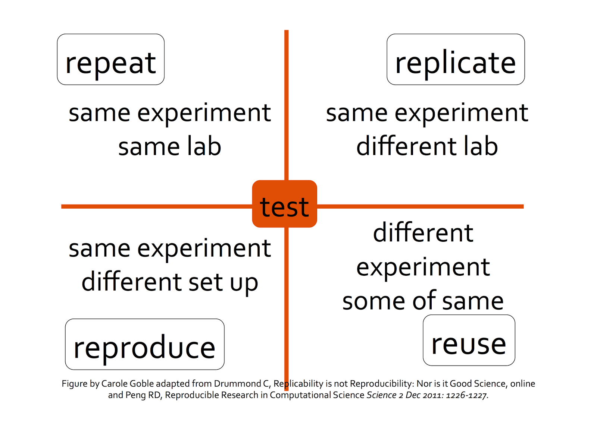

## Side note: Programmer vs. data scientist

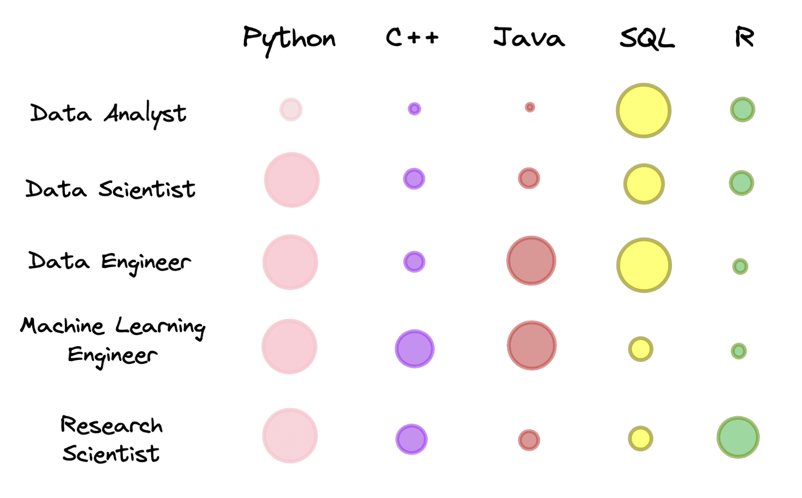

[source](https://www.kdnuggets.com/2023/06/programming-languages-specific-data-roles.html){.font70}

<!-- ## Side note: Programmer vs. data scientist -->

<!--  -->

<!-- [source](https://miro.medium.com/max/1400/1*WvOnZ27TdPUbJfa9q21QJw.png){.font70} -->

<!-- ## Side note: Programmer vs. data scientist -->

<!--  -->


<!-- [source](https://towardsdatascience.com/how-data-science-silos-undermine-application-modernization-14cee5ff3047){.font70} -->

##Literate programming

::: columns
::: {.column width="50%"}
-   R for reading in data
-   R for wrangling data
-   R for modeling
-   R for taking notes
-   R for presenting
-   R for writing
:::

::: {.column width="50%"}
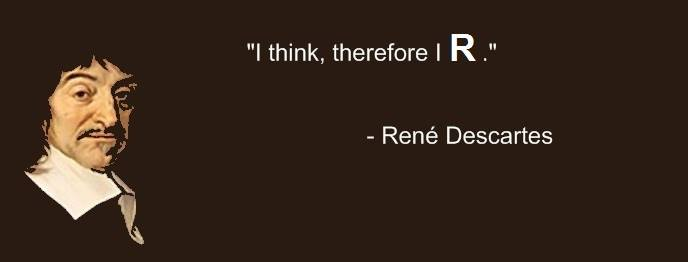
:::

In other words: [R for everything mindset]{.alert} (at least for today)
:::

##  Why R? A steep learning curve

::: r-stack
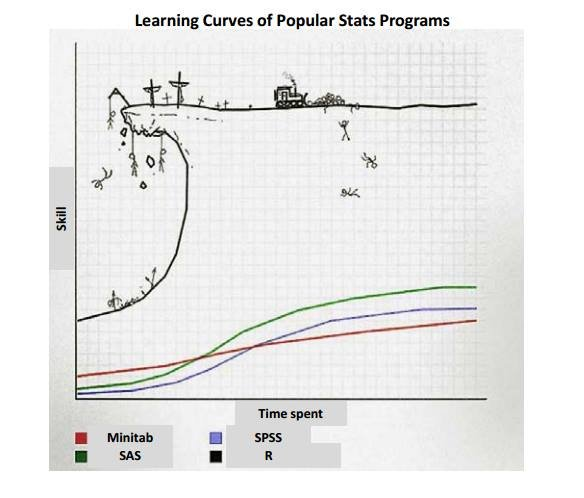{.fragment .fade-out}

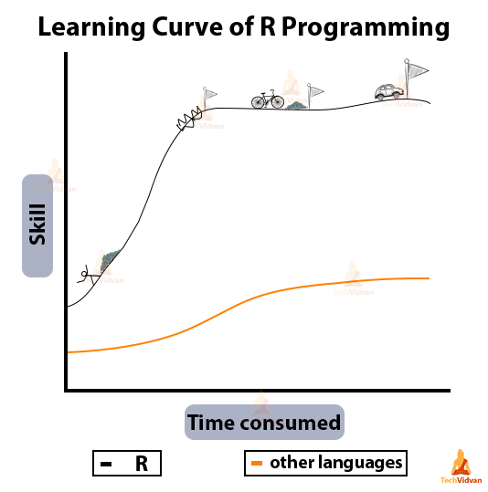{.fragment}
:::

## Why R then?

::: {.font70}
1.  Data manipulation.
2.  Automation.
3.  Faster computation.
4.  Any type of data (.txt, .csv, .dat, etc.).
5.  Easier project organization.\
6.  Larger data sets (though not always big data).
7.  Reproducibility.\
8.  Accuracy.
9.  Easier to find and fix errors.
10. Free.
11. Open source.
12. Advanced statistics.
13. State-of-the-art graphics.
14. Many platforms
15. Packages!

[Source for inspiration](https://fantasyfootballanalytics.net/2014/01/why-r-is-better-than-excel.html)
:::

## Side note: Use the right tool for the right job

-   Don't throw out Excel! [(see this podcast )](https://www.datacamp.com/community/podcast/spreadsheets-data-science)
-   But you can use opensource spreadsheet software like LibreOffice
-   or Google Slides
-   or Numbers
-   or NotePad++
-   ...

## Side note: ChatGPT

It must be said: you *can* ask ChatGPT to help you code.

But, to evaluate what generated code does, you still need a basic understanding (regardless of the programming language).

. . .

For instance, I know more or less how python works but I don't write it often enough to be fluent in it. But I am able to evaluate (basic) scripts that I get from ChatGPT or other LLMs.


# Let's get started

## Installing R

Prior to this crashcourse, I asked you to install R.

Who has done that? 🙋🙋

## R 4.6.1 (2026-06-14)

### 'Happy Hop'(or newer)

You can download it by clicking this link: https://cran.r-project.org/mirrors.html

Download the version that is the right one for your operating system (Windows / Mac)

Problems? https://www.r-project.org


# Installing RStudio

## RStudio

[RStudio](https://posit.co/){.external target="_blank"} is a Graphical User Interface for R and the one that is used by most people.

You can already use R by just opening it, but RStudio makes it easier.

Originally, RStudio was developed by the company Rstudio but they rebranded to [Posit]{.alert} a few years ago.

## Downloading

Go to [https://posit.co/download/rstudio-desktop/](https://posit.co/download/rstudio-desktop/){.external target="_blank"}

And also select the version for your operating system.

## RStudio

::: columns
::: {.column width="50%"}
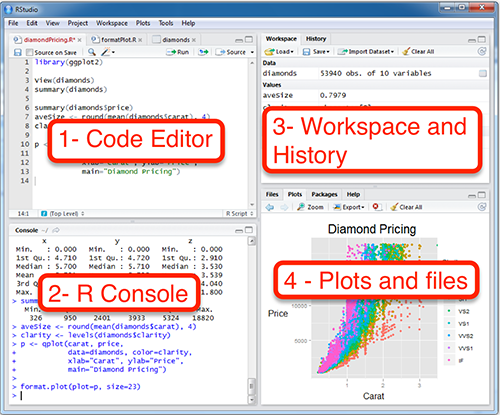


:::

::: {.column .font70 width="50%"}
(1) Top-left panel: **Code editor** allowing you to create and open a file containing R scripts and Rmarkdown documents.
(2) Bottom-left panel: **R console** for typing R commands
(3) Top-right panel:

-   **Workspace tab**: shows the list of R objects you created during your R session
-   **History tab**: shows the history of all previous commands

(4) Bottom-right panel:

-   **Files tab**: show files in your working directory
-   **Plots tab**: show the history of plots you created. From this tab, you can export a plot to a PDF or an image files
-   **Packages tab**: show external R packages available on your system. If checked, the package is loaded in R.
:::
:::

## RStudio Settings

### Open settings

::: columns
::: column
Windows

-   Tools → Global Options
-   shortcut: `CTRL ,`
:::

::: column
Mac

-   Tools → Global Options
-   Shortcut `⌘ ,`
:::
:::

✓ - Uncheck "Restore .RData into work space at start up"

✓ - Set "Save work space to .Rdata on exit" to "Never"

[[Source of tip: Emil Hvitfeldt](https://emilhvitfeldt.com/talk/2021-11-23-barcelona/)]{.font70}

## Rstudio settings

We can change what our RStudio looks like

[Appearance]{.alert2}: change the [color]{.alert} to what you want (I like `Cobalt`)

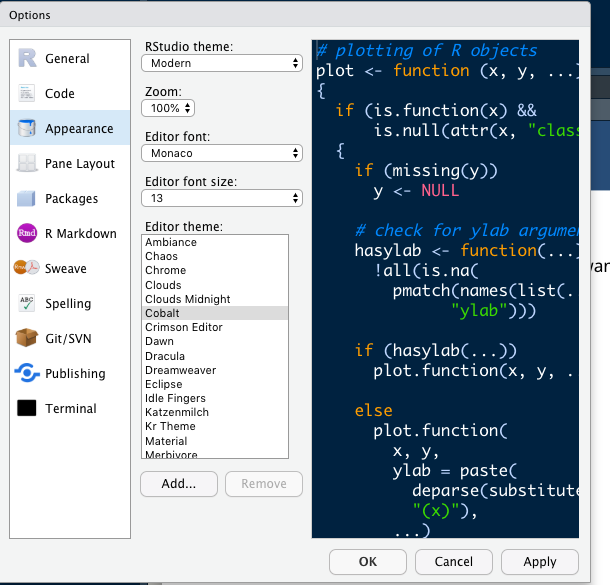

## Rstudio settings

[*Pane lay-out*]{.alert2}

I suggest

-   top-left [**code editor**]{.alert}
-   top-right [**R console**]{.alert}
-   bottom-left [**environment, history**]{.alert}
-   bottom-right [**files, plots, packages...**]{.alert}

But you're free to experiment of course

## R the calculator

The [console]{.alert} can be used as a simple calculator

Type / copy the following commands in the console

```{r}
#| eval: false
#| echo: true
1 + 1
3 - 2
4 * 5
10 / 2
```

The output will look like this

```
[1] 2
[1] 1
[1] 20
[1] 5
```

## R script

Now we're going to make an R script.

Click: [`file > new file > R Script`]{.alert}

Copy the previous calculations

```{r}
#| echo: true
#| eval: false
1 + 1
3 - 2
4 * 5
10 / 2
```

Click "Run"

## R script

You can:

-   (save it somewhere, doesn't matter now)
-   run the whole script
-   run line by line
    -   Windows: `CTRL  ENTER`
    -   Mac: `⌘  ENTER`

Below you can just keep copying the examples to this script.

## \<- operator

You can also [assign]{.alert} a value to a [variable]{.alert} and then call that variable

You assign with the `<-` operator

Think of it like the [container]{.smallcaps} metaphor: you put something in something else

```{r}
#| eval: false
#| echo: true

var1 <- 2 # type arrow hyphen <-

var1
```

📝

`=` can also be used as an operator, but it is better to [use if for arguments within a function]{.alert}, rather than for variables

## c() operator

But you can also put more than one value in a variable, with the `c()` function

(`c` stands for 'concatenate')

```{r}
#| echo: true
#| eval: false

var2 <- c(0.1, 0.2)

var2
```

## Other types of data

Of course you can also put words into variables, so-called [character strings]{.alert2})

```{r}
#| echo: true
var3 <- c("hello", "world", "你好")
```

Or you can put in [logical values]{.alert2}

```{r}
#| echo: true
var4 <- c(TRUE, FALSE)
```

. . .

After you run these two commands, you can check your [Environment tab]{.alert} and see that, indeed, all these variables exists in your current R session.

By looking at the [History tab]{.alert} you can see all the things R has done.

## Functions

Both `<-` and `c()` are functions: they act like the verbs in formal syntax

$$KISS(X, Y)$$

So, *John kisses Mary* can be expressed like

$$KISS(X = John, Y = Mary)$$

with

-   `KISS()` is the "verb"
-   `X` and `Y` are the arguments
-   `Zhangsan` and `Lisi` are the values of the arguments
-   📝 we use `=` for arguments in the function!

## Functions

Let's say we want to know what the mean is of the numbers 1 to 10.

We will need `c()`, then the numbers (by typing `1, 2, 3, ..., 10` or with the shortcut `1:10` '1 to 10').

Then we need to calculate the mean, either the long way ($\Sigma_{i}^{n} / n$) or the short way with `mean()`.

. . .

```{r}
#| echo: true
var5 <- c(1:10)
mean(var5)

# or
mean(c(1:10))
# or
mean(1:10)
```

## Dataframes

Data becomes most interesting if we can relate different things together.

That is where the [dataframe]{.alert} comes in.

A dataframe is basically a kind of [spreadsheet]{.alert2}, composed of different [vectors]{.alert} of **equal length**.

And we are going to make one!

```{r}
#| echo: true
#| eval: false
name <- c("Wilhelmina", "Juliana", "Beatrix", "Willem-Alexander")
gender <- c("female", "female", "female", "male")
job <- c("queen", "queen", "queen", "king")

data.frame(name, gender, job)
```


## Dataframes

```{r}
#| echo: true
name <- c("Wilhelmina", "Juliana", "Beatrix", "Willem-Alexander")
gender <- c("female", "female", "female", "male")
job <- c("queen", "queen", "queen", "king")

data.frame(name, gender, job)
```

You can also assign this of course:

```{r}
#| echo: true
myfirstdataframe <- data.frame(name, gender, job)

myfirstdataframe
```

## Dataframes and tibbles

I find that most things in R work best, or are most intuitive, if they are in a dataframe ([rectangle format]{.alert}).

So far, we have been using [Base R]{.alert2} (the basic functions that R always provides).

But in reality, I rarely use `data.frame()` -- instead I use the `tibble()` function from the `tidyr` package, which is part of the [tidyverse]{.alert}

```{r}
#| echo: true
#| eval: false
#| code-line-numbers: "|1"
tidyr::tibble()
# vs
data.frame()
```

## Installing packages

It is very easy to install packages in R.

Most packages will be available on CRAN, the network where accepted (and valid) packages are distributed.

If you want to install, e.g. the `tidyverse` package, you should do it like this:

```{r}
#| echo: true
#| eval: false
install.packages("tidyverse")
```

Do that now.

If it asks you if it should install other packages, you can say yes.

## Installing packages

Here are a number of other packages that are good to have (we will use them one of these weeks):

```{r}
#| eval: false
#| echo: true
#install.packages("rvest") # included in tidyverse
# install.packages("glue") # included in tidyverse
install.packages("rmarkdown")
install.packages("knitr")
install.packages("tidytext")
# install.packages("quanteda") # maybe we'll use it
install.packages("here")
install.packages("fs")
install.packages("readxl")
install.packages("writexl")
```


## Basic tidy R process

 [[source](https://tidyverse.tidyverse.org/articles/paper.html)]{.font70}

With this basic process, we can tackle a lot of problems.

## Rstudio Projects  [(Explore on your own)]{.alert}


Instead of an Rscript, it is better to use [RStudio Projects]{.alert2}

So click [`File > New Project > New Directory`]{.alert} and find a folder for it on your system.




## Rstudio Projects [(Explore on your own)]{.alert}

The advantages of using R Projects:

-   self contained folder
-   keep all relevant code together
-   you can send the folder to somebody
-   functions in the `here` package

. . .

instead of the long path "USERS/THOMAS/.../.../.../.../.../...(forever)"

you start from where that [.Rproject]{.alert2} object is located

→ files are easier to find


# Instead, Quarto document as the anchor itself

## Let's make a `.qmd`

Let's create a new file:

`File > New file > Quarto Document`


## Quarto documents

When you open a new file, you can test the export by clicking the `Render` button.

(and `Knit` in Rmarkdown files)


## Quarto documents

Now delete everthing starting from [line 6]{.alert2}.

We are left with the [YAML]{.alert2} header

-   title
-   format


## R chunks

Instead of one big R script, an [Rmarkdown]{.alert2} document works with [R chunks]{.alert2}

````
```{ r} #(without the space before the r)
SOME R CODE
```
````

This way you can incrementally make your code longer, <br> [have a conversation with your data.]{.alert}

Shortcuts:

-   Windows: `CTRL + ALT + i`
-   Mac: `⌘  + OPTION + i`

## Loading packages

```{r}
#| eval: false
#| echo: true
# the tidyverse, we will always load this
library(tidyverse)

# `here` for easy file paths
library(here)
here()

# readxl for reading excel files
library(readxl)
```

```{r}
#| echo: false
# the tidyverse, we will always load this
library(tidyverse)

# `here` for easy file paths
library(here)

# readxl for reading excel files
library(readxl)
```

## Worst practice 👿🤡

Traditionally, this is how people start a script:

```{r}
#| echo: true
#| eval: false
setwd("C:\Users\jenny\path\that\only\I\have")
#or
rm(list = ls())
```

But know that

-   Mac uses `/` and Windows uses `\`
-   Nobody else will have this path (including future you)

→ Violation of reproducibility

## Worst practice 👿🤡

::: columns
::: column
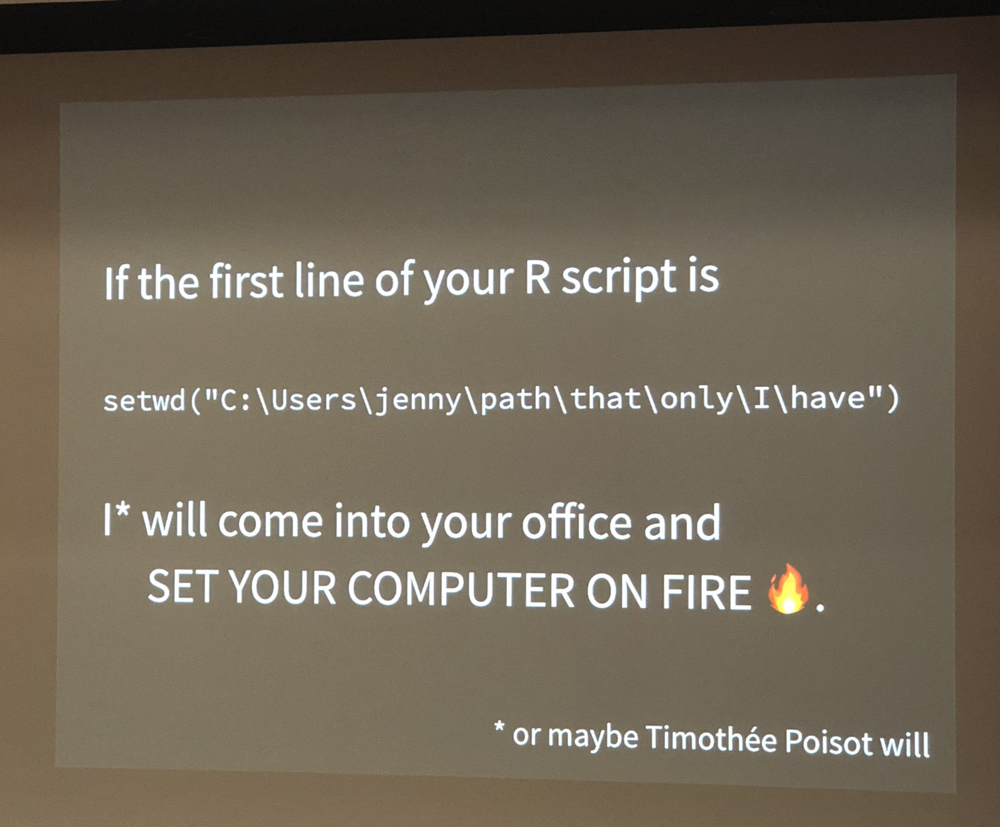
:::

::: column
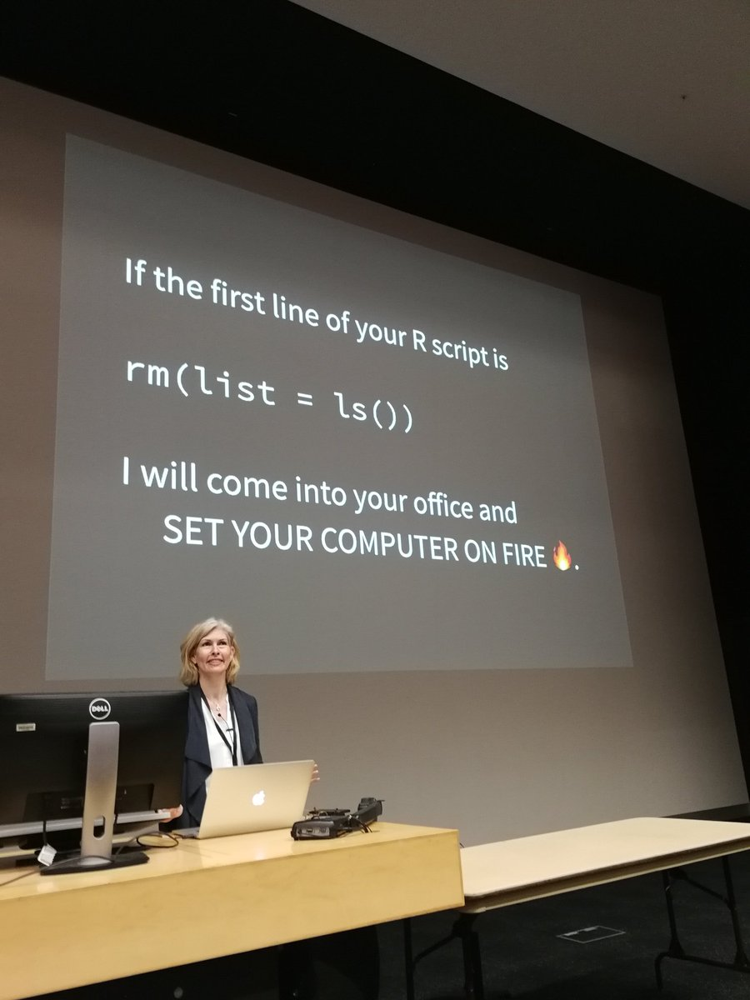
:::
:::

[[source: Jenny Bryan](https://www.tidyverse.org/blog/2017/12/workflow-vs-script/)]{.font70}

## Best practice 😎💯💅

Use the [here]{.alert2} package

-   Finds the nearest .Rproj file
-   alternatively, you can specify `here::i_am("NAME_OF_QMD.qmd)`
    - or `here::i_am("NAME_OF_RMD.Rmd)`
    
```{r}
#| eval: false
#| echo: true
here::i_am("zurich.qmd")) # or however you called your file

# test with
here::here()
```    


# A workflow case study


## Let's read in some data

Download the file "linguistsdataset.xlsx" from the github repository,  
by going there, and clicking [raw]{.alert2} or [the download button]{.alert2}

[https://github.com/simazhi/zurich/blob/main/data/linguistsdataset.xlsx](https://github.com/simazhi/zurich/blob/main/data/linguistsdataset.xlsx)


Place it in a subfolder "data" where your quarto document is saved.

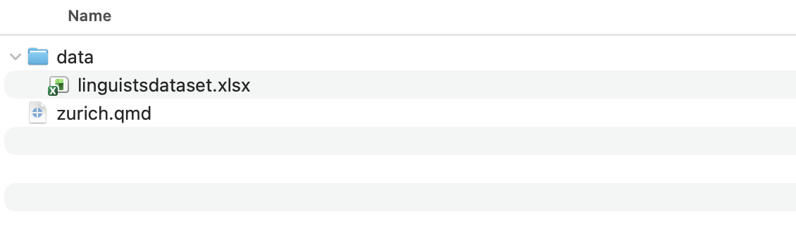


## Let's read in some data

```{r}
#| eval: false
#| echo: true
dataset <- read_excel(here("data", "linguistsdataset.xlsx"))
```

```{r}
#| echo: false
dataset <- read_excel(here("data", "linguistsdataset.xlsx"))
```

What did we do?

-   put our function in a variable with `<-`
-   read an excel file with `read_excel()`
-   the location of the file should be inside the \[./data\] folder, so we can use `here("data", "linguistsdataset.xlsx")`

## Check the file

Let's call the dataset and see what the [tibble]{.alert2} looks like

```{r}
#| echo: true
dataset
```

## Check the file

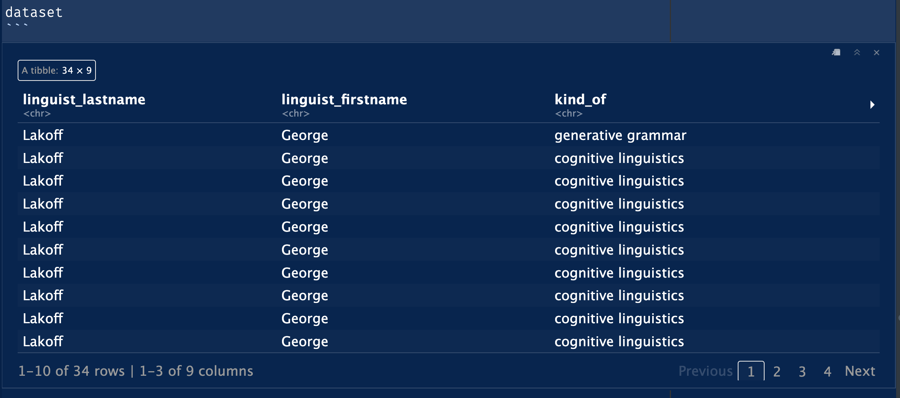

-   see the names of the variables (columns)
-   all the rows
-   what kind of data it is (numeric, logical, character...)

# Packages, and wrangling


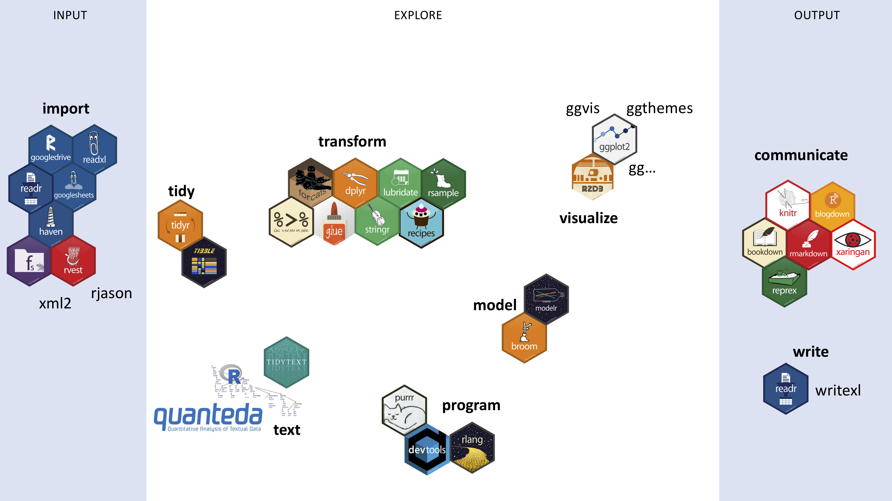

[[inspiration](http://www.storybench.org/getting-started-with-tidyverse-in-r/)]{.font70}


## dplyr "verbs"

With the `dplyr` package (loaded through the `library(tidyverse)`) we can manipulate the data.

This is where I tell you about the [CHEAT SHEETS](https://posit.co/resources/cheatsheets/){target="_blank"}.

You can also access them through Rstudio: `Help > Cheat Sheets > Data Transformation with dplyr`

## dplyr "verbs"

As you can see there are MANY verbs in the `dplyr` package.

But fear not: the most important ones are

-   `select` and `filter` and `distinct` and `slice`
-   `summarise` and `count` and `tally`
-   `group_by` and `ungroup`
-   `mutate` and `rename` and `case_when`
-   `arrange`

Basically the first page. I use these like 80% of the time.

## dplyr "verbs"

Let's say we want to see how many rows (observations) per linguist we have in this mini dataset.

::: columns
::: column
```{r}
#| echo: true
dataset %>%
  count(linguist_lastname)
```

So it seems we have 6 people (number of rows)
:::

::: {.column .fragment}
```{r}
#| echo: true

# alternative 1
dataset %>%
  count(linguist_lastname) %>%
  nrow()

# alternative 2
nrow(count(dataset, linguist_lastname))
```
:::
:::

## The pipe

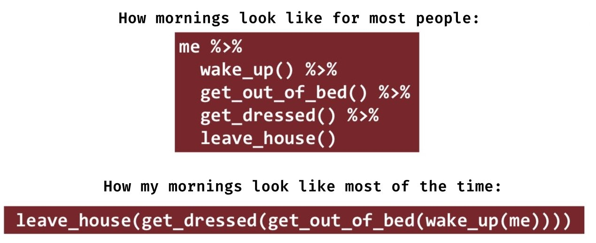

. . .

`|>` is the Base R pipe

`%>%` is the tidyverse pipe (shortcut: `CTRL/⌘ + Shift + M`)

[mostly the same](https://www.tidyverse.org/blog/2023/04/base-vs-magrittr-pipe/) but the tidyverse pipe came first <br> (in the `magrittr` package)

## Male vs. female

How about male versus female?

```{r}
#| eval: false
#| echo: true
dataset %>%
  distinct(linguist_lastname, gender) %>%
  count(gender)
```

. . .

```{r}
#| eval: true
#| echo: false
dataset %>%
  distinct(linguist_lastname, gender) %>%
  count(gender)
```

## Lifespan

Now we want to know how old every linguist is, or how long they lived

So we will need the columns `date_born` and `date_died`.

But if we look at `date_died` there are two problems:

-   this is a character vector
-   there are a lot of linguists still alive

So we need to \[mutate\] `date_died` to the year I made this exercise (2024).

## Lifespan

We'll do this in a few steps:

Select the variables `linguist_lastname`, `date_born`, `date_died`

```{r}
#| echo: true
#| eval: false
dataset %>%
  select(linguist_lastname, date_born, date_died)
```

## Lifespan

we need to change `"alive"` to `"2024"`

```{r}
#| echo: true
#| eval: false
#| code-line-numbers: "3-6"
dataset %>%
  select(linguist_lastname, date_born, date_died) %>%
  mutate(date_died = case_when(
    date_died == "alive" ~ "2024",
    TRUE ~ date_died
  ))
```

. . .

```{r}
#| echo: false
#| eval: true
dataset %>%
  select(linguist_lastname, date_born, date_died) %>%
  mutate(date_died = case_when(
    date_died == "alive" ~ "2024",
    TRUE ~ date_died
  ))
```

‼️ [Do you notice something off here?]{.alert}

## Lifespan

We need to turn `date_died` in a numeric vector (not character)

```{r}
#| echo: true
#| eval: false
#| code-line-numbers: "7"
dataset %>%
  select(linguist_lastname, date_born, date_died) %>%
  mutate(date_died = case_when(
    date_died == "alive" ~ "2024",
    TRUE ~ date_died
  )) %>%
  mutate(date_died = as.numeric(date_died))
```

## Lifespan

calculate `lifespan` and put in `lifespandf` object

```{r}
#| echo: true
#| code-line-numbers: "1,8-11"
lifespandf <-
  dataset %>%
  select(linguist_lastname, date_born, date_died) %>%
  mutate(date_died = case_when(
    date_died == "alive" ~ "2024",
    TRUE ~ date_died
  )) %>%
  mutate(date_died = as.numeric(date_died)) %>%
  mutate(lifespan = date_died - date_born)

lifespandf
```

## First visualization with ggplot2

How old did every linguist get?

```{r}
#| echo: true
#| eval: false
lifespandf %>%
  ggplot(aes(x = linguist_lastname, y = lifespan)) +
  geom_point()
```

‼️ Note that `ggplot` uses `+` instead of a regular pipe (`|>` or `%>%`).

. . .

```{r}
#| echo: false
#| out-width: 70%
lifespandf %>%
  ggplot(aes(x = linguist_lastname, y = lifespan)) +
  geom_point()
```

## Clean up visualization

```{r}
#| echo: true
#| code-line-numbers: "2|5|6|7|8"
lifespandf %>%
  rename(linguist = linguist_lastname) %>% #rename
  ggplot(aes(x = linguist, y = lifespan)) +
  geom_point() +
  geom_label(aes(label = lifespan)) + # add label of lifespan
  theme_minimal() + # add theme
  theme(axis.text = element_text(size = 14)) + # change size
  labs(title = "The lifespan of some linguists") # add title
```

## Communicate our findings

```
Chomsky is the oldest with 96 years old and counting.
Goldberg is now older than de Saussure was when he died.
Langacker is one year younger than Lakoff and they are approaching Wierzbicka who is 86 years old.
```

# Part 2: Regular expressions

## Packages


## `dplyr`, `stringr` are your friends


## The number 1 PhD skill

::: columns
::: column
<blockquote class="twitter-tweet">

<p lang="en" dir="ltr">

The single most useful skill that I brought to my PhD: Regular expressions! Here's regex turning semi-structured taxonomic data into structured and useful information. I've also used it to mine data out of websites. Learn regular expressions. <a href="https://twitter.com/hashtag/PhDLife?src=hash&amp;ref_src=twsrc%5Etfw">#PhDLife</a> <a href="https://twitter.com/hashtag/PhDChat?src=hash&amp;ref_src=twsrc%5Etfw">#PhDChat</a> <a href="https://twitter.com/hashtag/RStats?src=hash&amp;ref_src=twsrc%5Etfw">#RStats</a> <a href="https://t.co/CDBm3lcKMb">pic.twitter.com/CDBm3lcKMb</a>

</p>

— Desi Quintans (@eco_desi) <a href="https://twitter.com/eco_desi/status/988225095700238337?ref_src=twsrc%5Etfw">April 23, 2018</a>

</blockquote>

```{=html}
<script async src="https://platform.twitter.com/widgets.js" charset="utf-8"></script>
```
:::

::: {.column .fragment}
And I agree with this person that [regular expressions]{.alert2} will make your life better.

But what are they?

In a nutshell: [regular expressions]{.alert} allow you to find [patterns]{.alert}, and do stuff with them, like [extracting, removing, replacing]{.alert2}.
:::
:::

## Regex (regular expressions)

-   First create a new Quarto document
-   call it "strings"
-   save it as [`"strings.qmd"`]{.alert} in your folder

. . .

-   Delete the unnecessary rows <br> (everything below the first code chunk, called `set-up` (so below line 6))

## Load the `tidyverse` package

-   Load the relevant packages for this part

```{r}
#| echo: true
#| eval: true
library(tidyverse) 
# this will load stringr, the package we need
# you can also directly load library(stringr) 
# but you're missing out on many tidyverse functions then
```

## Regex cheat sheet

Just like for data transformation, there is a cheat sheet with strings for us.

Click on `Help > Cheat Sheets > Browse Cheat Sheets` and find the [String manipulation with stringr cheatsheet"]{.alert2}

Open it and enjoy the little pictures that help you pick the right function for your problem.

## The R afterparty

An example: the names of some people in a class I taught:

```{r}
#| echo: true
people <- c("Elena", "Ronya", "Gabriel", "Ya-Ping",
            "Shuguang", "Carolina", "Idan", "Maruša")
```

. . .

```{r}
#| echo: true
# let's look at the vector:
people
```

## The R afterparty

Suppose I want to invite only people with the letter R to my R-afterparty.

Using the cheat sheet, we can find the right function:

-   either under "detect matches"
-   or under "subset strings"

## The R afterparty

Looking at the cheat sheet, "subset strings" seems to do a better job at what I want, especially the `str_subset()` function

```{r}
#| echo: true
#| eval: false
people %>% # go to string, and then
  str_subset("r") # look for pattern "r"
```

. . .

Oh, but this isn't right! I also wanted to invite the people [capital R]{.alert2} and not just those with only [r]{.alert2}.

. . .

It turns out R is pretty literal...

## The R afterparty

### Option 1

Use [`[]`]{.alert} within the [pattern]{.alert2}.

Everything within [`[]`]{.alert} is interpreted as if it says [OR]{.alert2}.

```{r}
#| eval: false
#| echo: true
people %>% # go to string, and then
  str_subset("[rR]") # look for pattern "r"
```

## The R afterparty

### Option 2

Turn all letters [to lowercase]{.alert2} with [`str_to_lower()`]{.alert}

```{r}
#| eval: false
#| echo: true
invited <- people %>%           # go to string, and then
  str_to_lower() %>% # turn everything to lower, and then
  str_subset("r")    # look for pattern "r"

invited
```

**Notice that we save option 2 in a new vector [invited]{.alert2}**

## Most used `stringr` functions 😎💯💅

-   `str_replace` and `str_replace_all`
-   `str_remove` and `str_remove_all`
-   `str_extract` and `str_extract_all`

. . .

-   `str_trim` and `str_squish`
-   `str_to_lower` and `str_to_upper`

. . .

-   `str_c` and `str_split`

. . .

-   `str_subset`
-   `str_detect`
-   `str_glue`

## Most used `stringr` functions 😎💯💅

For a dataframe `df`, column `COL`, patterns `P1` and `P2`

```{r}
#| eval: false
#| echo: true
#| code-line-numbers: ""
str_replace(df, COL, P1, P2) # only the first

str_remove(df, COL, P1) 
# =
str_replace(df, COL, P1, "") # replacing by nothing is the same as removing

str_extract(df, COL, P1)

# the _all variants look for all occurrences of P1 in the COL
```

## Most used `stringr` functions 😎💯💅

For a dataframe `df`, column `COL`, patterns `P1` and `P2`

```{r}
#| eval: false
#| echo: true
#| code-line-numbers: ""
str_trim(df, COL, P1) # removes extra spaces from start and end of string

str_squish(df, COL, P1) # does the same + replace double spaces with 1 space only

str_to_lower(df, COL, P1) # lowercase
str_to_upper(df, COL, P1) # uppercase
str_to_sentence(df, COL, P1) # Sentence case
```

## Most used `stringr` functions 😎💯💅

For a dataframe `df`, column `COL`, vector `V1` and `V2`, pattern `P1`

```{r}
#| eval: false
#| echo: true
#| code-line-numbers: ""
str_c(V1, V2) # removes extra spaces from start and end of string

str_split(V1, pattern = P1)

# example
letter_mix <- str_c("Letter", letters, sep = ": ")
letter_mix
str_split(letter_mix, pattern = ":")
```

## Special Regex patterns

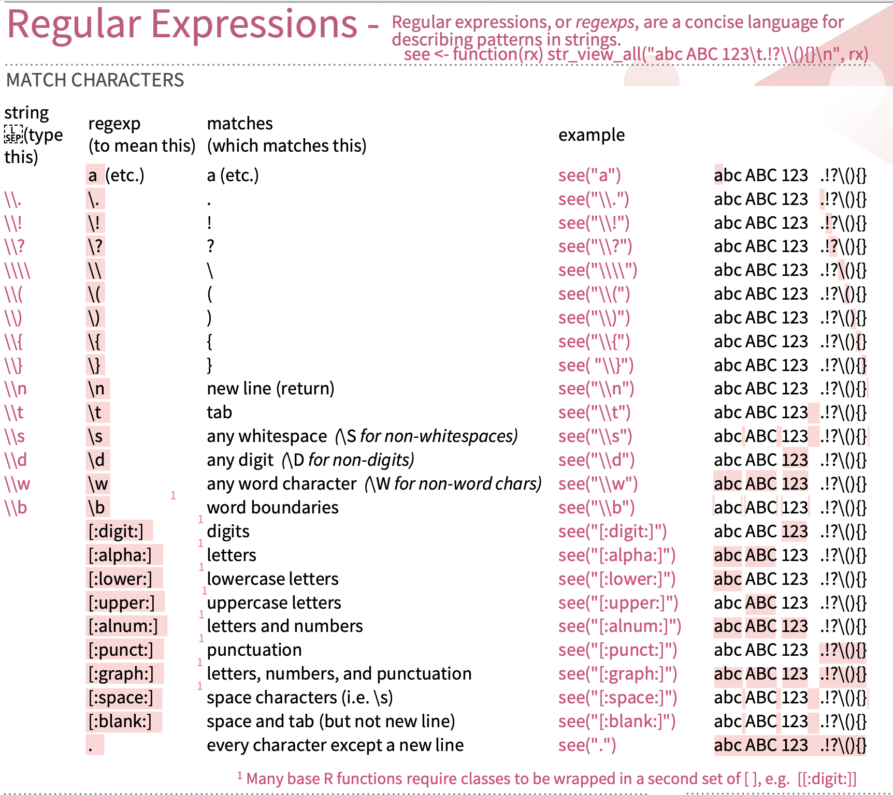

## Special Regex patterns

```{r}
#| echo: true
#| eval: false
str_subset(people, ".") # function(STRING, PATTERN)

str_subset(people, "\\wi") # any word character followed by 'i'

# hmmmm, let's try to get "c " (lowercase c preceded by a space)
str_subset(people, " c") # or "l\\s"
```

. . .

::: callout-warning
The last says command says: `character(0)`, because it can't find it.
:::

After all, we are just dealing with strings of single words, there are no spaces in our strings!

## Special Regex patterns

So let's first concatenate the [invited]{.alert2} people into one string with `str_c` and then then find a pattern with a space:

```{r}
#| echo: true
#| eval: false
invited_onestring <- str_c(invited, collapse = ", ") #  one string

str_subset(invited_onestring, " c") # subset
```

. . .

::: callout-warning
😠😠, now it just returns everything!!
:::

## Special Regex patterns

Oh because we just put [everything in one string]{.alert2}!!

Let's look at the `str_extract_all` function

```{r}
#| echo: true
#| eval: false
invited %>%
  str_c(collapse = ", ") %>% # one string
  str_extract_all(" c\\w+")  %>%     # the names with the pattern "SPACEc" until next comma
  str_squish()
```

## Regex: quantifiers

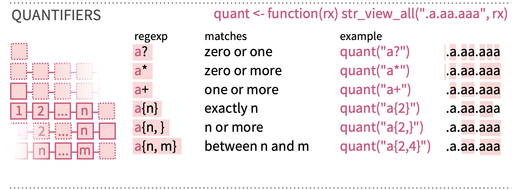

## Regex: quantifiers

```{r}
#| echo: true
#| eval: false

people_lower <- str_to_lower(people)
people_lower

str_subset(people_lower, "ab?n") # 0 or 1

str_subset(people_lower, "c*") # 0 or more
str_subset(people_lower, "c+") # 1 or more

str_subset(people_lower, "c{2}") #exactly two times
```

## Regex: alternates and anchors

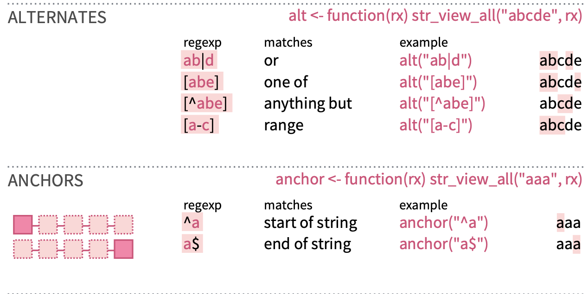

## Regex: alternates and anchors

```{r}
#| echo: true
#| eval: false

people_lower

str_subset(people_lower, "ab|na") # or
str_subset(people_lower, "a[bnl]") # one of


invited_onestring

# replace all that isn't "a" with an "!"
str_replace_all(invited_onestring, "[^a]", "!") # not this thing [^]
```

## Regex: alternates and anchors


```{r}
#| echo: true
#| eval: false
invited_onestring

# replace beginning of string with "!@!"
str_replace_all(invited_onestring, "^.", "!@!") 

# replace end of string with "!@!"
str_replace_all(invited_onestring, ".$", "!@!") 
```


## Regex: groups

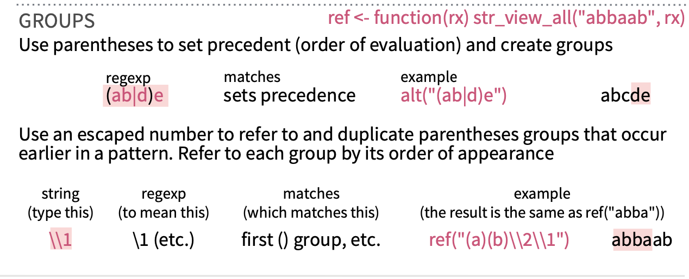

## Regex: groups

```{r}
#| echo: true
#| eval: false

invited_onestring

# replace group of string with itself + "!@!"
str_replace_all(invited_onestring, "(a[bn])", "\\1!@!") 

```

## Regex: look around

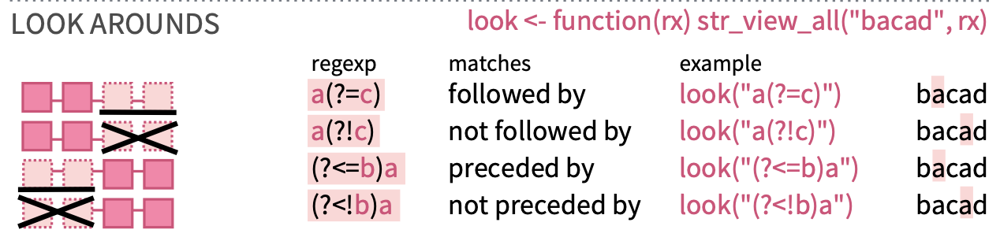

```{r}
#| echo: true
#| eval: false

invited_onestring

# replace "a" with "!@!" if preceded by a "c"
str_replace_all(invited_onestring, "(?<=c)a", "!@!") 

```


## Chinese excursion

You are now able to handle most of the text related problems you can face!

For instance, Chinese surnames and names:

-   Thomas: Sima Zhi 司馬 智
-   Ya-Ping: 劉 雅蘋

```{r}
#| echo: true
#| eval: false

chinesenames <- c("司馬 智", "劉 雅蘋") # Thomas, Ya-Ping

chinesenames

chinesenames %>%
  str_replace_all(" ", "")
```

## Chinese surnames and names

Let's put it in a [tibble]{.alert2} (tidy dataframe) with `tibble()`

```{r}
#| echo: true
#| eval: false

surnames <- c("司馬", "劉")
firstnames <- c("智", "雅蘋")

chinesenames <- tibble(surnames, firstnames) 

chinesenames
```

## Chinese surnames and names

Alternative with [`tribble()`]{.alert}

```{r}
#| echo: true
#| eval: false

chinesenames <- tribble(
  ~ surnames, ~ firstnames,
  "司馬", "智",
  "呂", "佳蓉"
)

chinesenames
```

## Chinese surnames and names

Putting them together

1.  `mutate` for changing a dataframe, `str_c()` for combining
2.  `mutate` for changing a dataframe, `str_glue()` for gluing

```{r}
#| echo: true
#| eval: false

chinesenames %>%
  mutate(together = str_c(surnames, firstnames)) %>% 
  mutate(together2 = str_glue("{surnames}, {firstnames}"))
```

# Part 3: Working with text

## Getting data in and out of R

To start wrangling, we need stuff to wrangle with. <br> We need to import data.

There is another cheat for this too `Help > Cheat Sheets > Data Import`

. . .

Looking at that pdf, there are are a few subsections on this cheat sheet:

1.  Read Data
    -   Read Tabular Data
    -   Read Non-tabular Data
2.  Write / Save data

## Importing data (1)

| data type     | extension | package     | function        | comment                                                                                                                                                        |
|--------|--------|--------|--------|-----------------------------------------|
| text          | .txt      | `readr`     | `read_file()`   | single string                                                                                                                                                  |
| text          | .txt      | `readr`     | `read_lines()`  | one string per line                                                                                                                                            |
| csv           | .csv      | `readr`     | `read_csv()`    | tibble                                                                                                                                                         |
| table in text | .txt      | `readr`     | `read_delim()`  | tibble                                                                                                                                                         |
| excel         | .xls(x)   | `readxl`    | `read_excel()`  | tibble                                                                                                                                                         |
| RDS           | .rds      | `readr`     | `read_rds()`    | dataframe                                                                                                                                                      |
| xml           | .xml      | `xml2`      | `read_xml()`    | [vignette](https://xml2.r-lib.org), [tutorial](https://jennybc.github.io/purrr-tutorial/index.html)                                                            |
| json          | .json     | `jsonlite`  | `fromJSON()`    | [vignette](https://cran.r-project.org/web/packages/jsonlite/vignettes/json-aaquickstart.html), [tutorial](https://jennybc.github.io/purrr-tutorial/index.html) |
| pdf           | .pdf      | `textreadr` | `read_pdf()`    | tibble, [vignette](https://github.com/trinker/textreadr)                                                                                                       |
| doc           | .doc(x)   | `textreadr` | `read_doc(x)()` | tibble, [vignette](https://github.com/trinker/textreadr)                                                                                                       |

## Importing data (2)

Other ones you may need:

| data type    | extension | package      | function     | comment                                                                                     |
|----------|----------|----------|----------|-----------------------------------|
| google sheet | .gs       | googlesheets | ?            | [tutorial](https://cran.r-project.org/web/packages/googlesheets/vignettes/basic-usage.html) |
| SAS          | .sas7bdat | `haven`\]    | `read_sas()` | [tutorial](https://www.rdocumentation.org/packages/haven/versions/2.1.1)                    |
| SPSS         | .sav      | `haven`      | `read_sav()` | [tutorial](https://www.rdocumentation.org/packages/haven/versions/2.1.1)                    |
| STATA        | .dta      | `haven`      | `read_dta()` | [tutorial](https://www.rdocumentation.org/packages/haven/versions/2.1.1)                    |

::: callout-tip
Mac [Numbers]{.alert2} files can be read into R by exporting the `.numbers` file as a `.csv` file.
:::

## Writing data

This becomes really simple with the tidyverse, because most of the time you just replace `read_DATATYPE` with `write_DATATYPE`:

| data type     | extension | package   | function        | comment             |
|:--------------|:----------|:----------|:----------------|:--------------------|
| text          | .txt      | `readr`   | `write_file()`  | single string       |
| text          | .txt      | `readr`   | `write_lines()` | one string per line |
| csv           | .csv      | `readr`   | `write_csv()`   | tibble              |
| table in text | .txt      | `readr`   | `write_delim()` | tibble              |
| excel         | .xls(x)   | `writexl` | `write_xlsx()`  | tibble              |
| RDS           | .rds      | `readr`   | `write_rds()`   | dataframe           |

## Taking stock (of the tidyverse)

::: columns
::: column
-   **import**: `readr`, `readxl`
-   **tidy**: `tidy`, `tibble`
-   **transform**: `dplyr`, `stringr`
-   **text**
-   **program**
:::

::: column
-   **model**
-   **visualize**: `ggplot2`
-   **export**
-   **communicate**: `rmarkdown`, `knitr`
:::
:::

# Tidytext

## Tidytext

::: columns
::: {.column width="60%"}

Straightforward and tidy way of working with text in R.

You can see the case studies [on this website](https://www.tidytextmining.com/).

The most useful function in this package is `unnest_tokens()`

:::

::: {.column width="40%"}

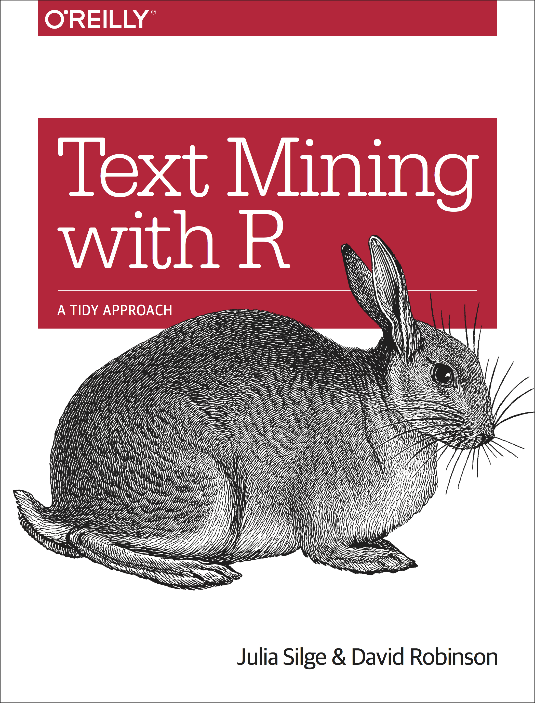

:::
:::

## New document

Let's make a new Quarto document 'tidytext.qmd' in our folder.

And let's restart our session so we start with a clean slate  
`Session > Restart R`

. . .

Clean and get our packages set up

```{r}
#| echo: true
#| eval: false

library(tidyverse)
library(here)
here::i_am("tidytext.qmd")
library(tidytext)
library(janeaustenr)   # if you don't have this install with install_packages("janeaustenr")
```


```{r}
#| echo: false
#| eval: true

library(tidytext)
library(janeaustenr) 
```


## Example of `unnest_tokens()`

```{r}
#| echo: true


ed_text <- c("Because I could not stop for Death -",
          "He kindly stopped for me -",
          "The Carriage held but just Ourselves -",
          "and Immortality")
```

```{r}
#| echo: true
ed_text
```

## Let's put that in a dataframe

In R, we like most things in rectangles for analysis.

```{r}
#| echo: true
#| eval: true

text_df <- tibble(line = 1:4, text = ed_text)

text_df

```

## Now let's put that in longer format

```{r}
#| echo: true
#| eval: false

text_df %>%
  unnest_tokens(output = word, input = text)
```

## Now let's put that in longer format

```{r}
#| echo: false
#| eval: true
#| 
text_df %>%
  unnest_tokens(output = word, input = text)
```

## N-grams and correlations

Often we want to considere groups of words.  
If our groups are 2 words, we call that [bigrams]{.alert2} (2-grams), with N = 2.  
Groups of N=3 are called [trigrams]{.alert2}

. . .

In the work of Jane Austen, 2-grams would be

````
sense and
and sensibility
by jane
jane austen
the family
family of
of dashwood
dashwood had
````

## 2-grams of Jane Austen

```{r}
#| echo: true
#| eval: false
#| code-line-numbers: "2|3|4|1|1-4"

austen_bigrams <- 
  austen_books() %>%
  unnest_tokens(bigram, text, token = "ngrams", n = 2) %>%
  filter(!is.na(bigram))
```

. . . 

```{r}
#| echo: false
#| eval: true

austen_bigrams <- 
  austen_books() %>%
  unnest_tokens(bigram, text, token = "ngrams", n = 2) %>%
  filter(!is.na(bigram))

austen_bigrams
```

## Counting bigrams


```{r}
#| echo: true
#| eval: true

austen_bigrams %>% 
  count(bigram, sort = TRUE)
```

. . . 

Most of these are function word combinations, 
which may or may not be what you're looking for.

## What is this good for?

But suppose we want to look at [streets]{.alert} and compare these [per book]{.alert2}?

```{r}
#| echo: true
#| eval: true

bigrams_separated <- 
  austen_bigrams %>%
  separate(bigram, c("word1", "word2"), sep = " ")

bigrams_separated
```

## Often you want to remove stop words

If you are interested in content words, remove the stop words.

TidyText comes with a handy dataframe called `stop_words`.

You can use this directly, or if you want you can also make this visible in your Environment pane by running `data(stop_words)`

## Removing stop words from our separated bigrams

```{r}
#| echo: true
#| eval: false

stop_words

bigrams_filtered <- 
  bigrams_separated %>%
  filter(!word1 %in% stop_words$word) %>% # ! means not
  filter(!word2 %in% stop_words$word)
```

```{r}
#| echo: false
#| eval: true

bigrams_filtered <- 
  bigrams_separated %>%
  filter(!word1 %in% stop_words$word) %>% # ! means not, %in% looks for items of the right hand side within the left hand side
  filter(!word2 %in% stop_words$word)

bigrams_filtered
```

## Removing stop words from our separated bigrams

```{r}
#| echo: true
#| eval: false

bigram_counts <- 
  bigrams_filtered %>% 
  count(word1, word2, sort = TRUE)
```

```{r}
#| echo: false
#| eval: true

bigram_counts <- bigrams_filtered %>% 
  count(word1, word2, sort = TRUE)

bigram_counts
```

. . .

Much more interesting, right?

## Repeat, but let's include the books

```{r}
#| echo: true
#| eval: true
#| code-line-numbers: "1|2|6|7|8|10"

austen_bigrams %>% # books and bigrams we made above
  separate(bigram, c("word1", "word2"), sep = " ") %>% 
  filter(!word1 %in% stop_words$word) %>% 
  filter(!word2 %in% stop_words$word) %>% 
  
  filter(word2 == "street") %>% 
  count(book, word1, sort = TRUE) %>% 
  rename(street = word1) %>% 
  
  pivot_wider(names_from = street, values_from = n)
```

```{r}
#| echo: false
#| eval: false

austen_bigrams %>% # books and bigrams we made above
  separate(bigram, c("word1", "word2"), sep = " ") %>% 
  filter(!word1 %in% stop_words$word) %>% 
  filter(!word2 %in% stop_words$word) %>% 
  
  filter(word2 == "street") %>% 
  count(book, word1, sort = TRUE) %>% 
  rename(street = word1) %>% 
  
  pivot_wider(names_from = street, values_from = n)
```

# Taking stock, where to go next

And after that some of the case studies you asked me

## Extra case study

In case we go super fast, and you want to practice more.

There is another case study on Star Trek species that repeats most of what we've seen thus far.

## Starting points after this crash course


## Starting points after this crash course

Programming languages require some time investment to become [literate enough]{.alert2}, but it doesn't have to suck.

::: columns
::: {.column width="50%"}

My number one go-to teaching guide: *R for Data Science*  
[https://r4ds.hadley.nz/](https://r4ds.hadley.nz/)


:::

::: {.column width="50%"}{.fragment}

Chapters are short, and involve lots of copy-pasting.

For this audience, the following chapters might be most useful (but all of them are useful).

* ch. 1-7 basic workflow
* ch. 9-11 visualisation (for yourself and others)
* ch. 12-15, 18-19 transforming data
* ch. 20 importing data
* ch. 25-26 on writing functions and itering over items

:::
:::

## Starting points after this crash course

After *R for Data Science*, I'd go with *TidyText*
::: columns
::: {.column width="50%"}


:::

::: {.column width="50%"}{.fragment}

Chapters are short, and involve lots of copy-pasting.

For this audience, the following chapters might be most useful (but all of them are useful).

* ch. 1-5 basic workflow
* case studies you're interested in

:::
:::


## Linguistics with R

*Quantitative corpus linguistics with R: A practical introduction* ([Gries]{.alert2}, 2016) and *Statistics for linguistics with R* ([Gries]{.alert2}, 2021)

::: columns
::: {.column width="31%"}
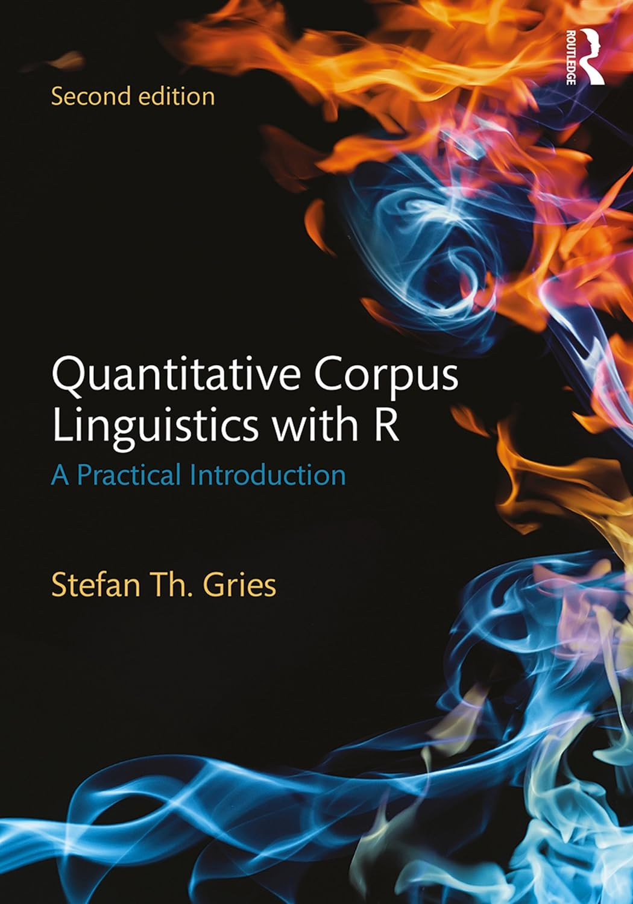
:::

::: {.column width="30%"}
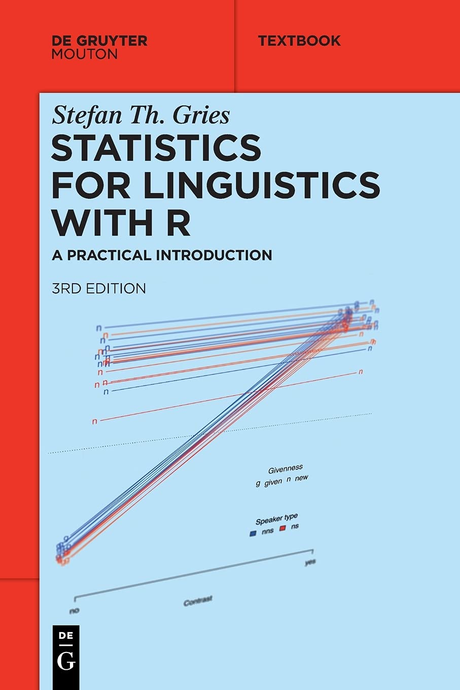
:::
:::

## Linguistics with R

*How to do linguistics with R* ([Levshina]{.alert2}, 2015)

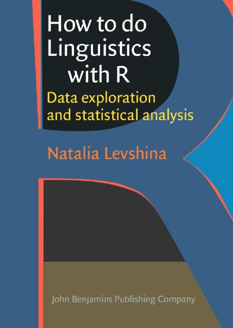

This is a handy reference and something I still use from time to time.

## How robust is R?

The goal of today was to introduce you to R and showcase some of it's programming philosophy.

So [breaking down in steps]{.alert2}, [finding logical order]{.alert2}, [trial and error]{.alert2} are all part of the game.

The upshot is that R code is [incredibly robust]{.alert2}.  
It is well-maintained, and many of my scripts from 10 years ago (time flies) still run.

## Vibecoding

If you want to *vibecode* with LLM's like ChatGPT (something these tools are relatively good at), it's good to tell in your initial prompt that you want

`an R solution (tidyverse style)`

That will be most similar to the type of R language I have shown today.

There is also "Base R", and that becomes more important if you are more of a programmer and care about efficiency, but tidyverse is a bit more wordy / "humanlike" and thus easier to parse for beginners to intermediate to advanced users.

A big difference between R and Python is that in R there are multiple roads that lead to Rome, while in Python there is preferably a single road but road should be so obvious other roads aren't even considered.


# Any questions?

Before we dive into the applications?

# Applications based on your questions

Based on a quarto script


