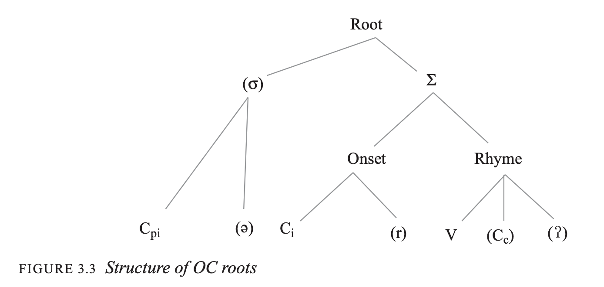

# Main idea

Some thoughts and process to address your (14! pages of) great questions.

# Setup


```{r}
library(tidyverse)
library(here)
here::i_am("2_applications.qmd")
library(tidytext)
library(readxl)
library(janitor)
```
```{r}
# devtools::install_github("simazhi/baxteRsagaRt/baxteRsagaRt")
library(baxteRsagaRt)
```


# Liu Chunxiao

## Exerpt

> Tiandi 天地 chapter, Zhuangzi
> 
> Huangdi (i.e., the Yellow Emperor) wandered north of the Red River, ascended Mount Kunlun, and gazed southward. When he returned, he had lost his black pearl. He dispatched Zhi to seek it, but [Zhi] could not obtain it. He dispatched Lizhu to seek it, but [Lizhu] could not obtain it. He dispatched Chigou to seek it, but [Chigou] could not obtain it. Then he dispatched Xiangwang, and Xiangwang obtained it. Huangdi exclaimed: “How strange! Is it truly through Xiangwang that one can obtain it? 

> 黃帝遊乎赤水之北，登乎崑崙之丘而南望，還歸，遺其玄珠。使知索之而不得，使離朱索之而不得，使喫詬索之而不得也。乃使象罔，象罔得之。黃帝曰：「異哉！象罔乃可以得之乎？」


If we reconstruct the syllables, Chunxiao hypothesizes there are many rhyming ones, which could be indications of ideophones or deideophonized names.

(I'm assuming Baxter & Sagart 2014 is assumed throughout)

* OC \* -aŋ
* OC \* -ek(-s)~ok(s), which is a [-round ~ +round] combo
* OC \* raj~ro, which is a [-round ~ +round] combo

## Dataset

We skip (first) through the hard part of getting OC transcriptions  
(You are more knowledgeable about this verification than I am)

Chunxiao gave us a excel table.

```{r}
orig <-
  read_xlsx(here("data", "tiandi.xlsx"), col_names = FALSE) %>% 
  clean_names()
```

Wrangling phase

```{r}
wrangled <- 
  orig %>% 

  mutate(pair = (row_number() + 1) %/% 2,
           type = if_else(row_number() %% 2 == 1, "word", "reconstruction")) %>%

  rename(line = 1) %>%
  fill(line, .direction = "down") %>%
  

  pivot_longer(cols = -c(line, pair, type), # longer combo, longer
               names_to = "position",
               values_to = "value") %>%
  
  pivot_wider(names_from = type,       # wider format
              values_from = value) %>%
  
  filter(!is.na(word), word != "") %>% # remove empty positions
  
  # get the numbers correctly
  group_by(line) %>%  
  mutate(word_number = row_number()) %>%
  ungroup() %>%
  
  # final selection
  select(line, word_number, 
         chinese = word, reconstruction)
```

Let's see if we can decompose the reconstructions + make a "dumb" version of them



Let's go for

- presyllable
- main syllable
- suffix


```{r}
wrangled2 <-
  wrangled %>% 
  mutate(reconstruction = str_remove(reconstruction, "\\*")) %>% 
  mutate(recon_nobrack = str_remove_all(reconstruction, "[\\[\\]\\(\\)]")) %>% 
  mutate(presyl = str_extract(recon_nobrack, "^[^-]+(?=-)"),
         suffix = str_extract(recon_nobrack, "(?<=-)s$")) %>%  # if there are more than s, you can put [srtvx]
  
  # solve some problems
  mutate(presyl = if_else(!is.na(suffix) & str_detect(recon_nobrack, "^[^-]+(?=-)"), 
                          NA_character_,
                          presyl)) %>% 
  
  # get the main syllable
  mutate(mainsyl = recon_nobrack,
         mainsyl = if_else(presyl != "" & !is.na(presyl),
                           str_remove(mainsyl, paste0("^", presyl, "-")),
                           mainsyl),
         mainsyl = if_else(suffix != "" & !is.na(suffix),
                           str_remove(mainsyl, paste0("-", suffix, "$")),
                           mainsyl))
```

```{r}
wrangled2
```

## Vowels and rhymes


Now we need to find information about 

- the vowels
- rhymes

in the main syllable, so we can 


What are the values that vowels can have in this OC reconstruction?
```{r}
vowels <- c("a", "e", "u", "ə", "o", "i",
            "A", "E", "U",      "O", "I") # six way system (?)
```


```{r}
wrangled3 <-
  wrangled2 %>% 
  # we want to just extract the vowel
  mutate(vowel = str_extract(mainsyl, paste(vowels, collapse = "|"))) %>% 
  
  # and get the final consonant
  mutate(final_c = str_extract(mainsyl, paste0("(?<=", vowel, ").+$"))) %>% 
  
  # turn it in a final
  unite(col = final, # newcol
        c(vowel, final_c),
        sep = "",
        remove = FALSE) %>% 
  mutate(final = str_remove(final, "NA")) %>% 
  
  # but maye you want one that doesn't have the glottal stops
  mutate(final_noglot = str_remove(final, "ʔ"))

wrangled3
```

## Problem 1: names

We can assume that names will consist of two (or more, but question had two) syllables that follow each other, within the same line.

So that means we need adjacent pairs.

That way we can find Xiangwang 象罔 *s.[d]aŋʔ+maŋʔ   (or dumb version: s.daŋ maŋ )  
but also all the different variants that may exist

> Variants attested across pre-Qin and Han texts: Wangliang 罔兩 (*maŋʔ+p.raŋʔ > mjangX-ljangX), Wangliang 蝄/蛧蜽 (OC *maŋʔ+[r]aŋʔ > mjangX-ljangX), Wangxiang 罔象 (*maŋʔ+s.[d]aŋʔ > mjangX-zjangX), and Wushang 无傷 (*ma+l̥aŋ > mju-syang), Fangliang 方良 (*paŋ+[r]aŋ > pjang-ljang), Fanglang 方閬 (*paŋ+[r]ˤaŋ > pjang-lang), Fenyang 羵羊 (*[b]ə[n]+ɢaŋ > bjun-yang), Wangxiang 魍象 (*maŋʔ+s.[d]aŋʔ > mjangX-zjangX), Wangliang 魍魎 (*maŋʔ+p.raŋʔ > mjangX-ljangX), Wanghang 罔行 (*maŋʔ+[g]ˤaŋ > mjangX-hang), and Fangxiang 方相. 


```{r}
wrangled4 <- 
  wrangled3 %>%
  group_by(line) %>%
  arrange(word_number, .by_group = TRUE) %>%
  
  
  mutate(next_final = lead(final_noglot),
         rhyme_match_next = final_noglot == next_final) %>%
  ungroup()

wrangled4
```

or (and I got this from ChatGPT, because maybe there is a better way of presenting it)

```{r}
adjacent_pairs <- 
  wrangled3 %>%
  group_by(line) %>%
  arrange(word_number, .by_group = TRUE) %>%
  
  mutate(
    line,
    word1 = word_number,
    chinese1 = chinese,
    final1 = final_noglot,
    word2 = lead(word_number),
    chinese2 = lead(chinese),
    final2 = lead(final_noglot),
    rhyme_match = final1 == final2,
    .keep = "none"
  ) %>%
  
  filter(!is.na(word2)) %>%
  ungroup()
```

Then you can filter

(probably you're not interesed in 不、而、之 etc. for this)

```{r}
adjacent_pairs %>% 
  filter(rhyme_match == TRUE) %>% 
  filter(!chinese1 %in% c("不", "而", "之")) %>% 
  filter(!chinese2 %in% c("不", "而", "之")) #%>% 

```

This method finds direct final rhyming, and can then be scaled, provided you have OC reconstruction.

## Problem 1: round and unround

We first need to annotate that for that, and then repeat the adjacency pair code

```{r}
adjacent_pairs2 <-
  wrangled3 %>% 
  mutate(roundness = case_when(
    vowel %in% c("i", "I", "e", "E") ~ "unround",
    vowel %in% c("o", "O", "u", "U") ~ "round",
    .default = "other"
  )) %>% 
  
  
## adapted from above  
 group_by(line) %>%
  arrange(word_number, .by_group = TRUE) %>%
  mutate(
    word1 = word_number,
    chinese1 = chinese,
    final1 = final_noglot,
    vowel1 = vowel,
    coda1 = final_c,
    roundness1 = roundness,

    word2 = lead(word_number),
    chinese2 = lead(chinese),
    final2 = lead(final_noglot),
    vowel2 = lead(vowel),
    coda2 = lead(final_c), 
    roundness2 = lead(roundness),

    roundness_transition = case_when(
      roundness1 == "unround" & roundness2 == "round" ~ "unround-round",
      roundness1 == "round" & roundness2 == "unround" ~ "round-unround",
      TRUE ~ "other"
    ),

    same_coda = coda1 == coda2,

    .keep = "none"
  ) %>%
  filter(!is.na(word2)) %>%
  ungroup() 
  
  
```


```{r}
adjacent_pairs2 %>%
  filter(roundness_transition != "other",
         same_coda == TRUE)
```

So this one gets Chigou 喫詬 (*kʰˤrek-s+kʰˤok-s > kheaH-khuwH)

(based on ek-ok)

but

> In the Huainanzi, the name is written as Jieduo 捷剟 (*[dz][a]p+*tˤot).

That would require different pattern identification, because you have ap-ot.
Maybe here it would be harder to detect those combinations.

And extending that for

> Lizhu 離朱 (*[r]aj+to)

If you can formulate your question in terms of a regular expression, you can start looking for it with similar methods as above, but then taking into account the initial (not split off in our data yet) and roundness patterns.


## Problem 2:

> In close reading process, I often encounter meaningful sound and sound-meaning patterns. How to test such patterns in a larger corpus?

The patterns are things like 

> OC phonological overlap between Huangdi (*N-kʷˤaŋ+tˤek-s) and Xiangwang de (象)罔得 (*s.[d]aŋʔ+maŋʔ tˤək) suggest a prospective phonic foreshadowing; this sound pattern may further link the story to the immediately preceding discussion concerning wangde 王德 (*ɢʷaŋ+tˤək > hjwang-tok).

This is also a perfect regular expression case.

We can either look at this pattern that was intuitively felt to see how often it occurs
(A far-reaching statistical approach would eventually get association measures but that's perhaps overkill here).

Or, we can count how often particular patterns occur in our text sample.

### This specific pattern

In this case, we assume something like

(ʷ)(ˤ)aŋ   tˤ(e)k

or in R regex speak

ʷ?.aŋ   tˤ.k       
= the w is optional, there is maybe something in between, but definitely aŋ
= definitely tˤ, we don't care about vowels and infixes, definitely k

Luckily we already did the hard work

```{r}
wrangled3 %>%

 group_by(line) %>%
  arrange(word_number, .by_group = TRUE) %>%
  mutate(
    word1 = word_number,
    chinese1 = chinese,
    phon1 = recon_nobrack,

    word2 = lead(word_number),
    chinese2 = lead(chinese),
    phon2 = lead(recon_nobrack),
    .keep = "none"
  ) %>% 
  
  mutate(pattern_match = if_else(
    str_detect(phon1, "ʷ?.aŋ") & str_detect(phon2, "tˤ.k"),
    TRUE,
    FALSE
  )) %>% 
  
  filter(pattern_match == TRUE)

```

### Broader potential patterns like this

I would use the previous adjacent_pairs2 we made to figure that out

If you count and sort them, you might get interesting leads

e.g. aŋ-aŋ is special (n = 3)
ə-ə is probably coincidence (n = 9)
aŋ-ek has potential (n = 2)

```{r}
adjacent_pairs2 %>% 
  count(final1, final2, sort = TRUE)
```

# Rafeal Suter

## Problem 

There are semi-rhyming sets in particular texts (like Chunqiu Fanlu 35) that may be structuring patterns

## Potential attack plan

Similar to Chunxiao's question, starting point is an already annotated text with OC.

You can then indeed turn it into a table and add columns with relevant features, similar to what we did with the roundness column.
You define yourself what certain values mean and annotate that.

Based on that you count.


The "wang" like rhymes will be easily identiable.
(王、皇、方、匡、黃、往)

The "jun" ones perhaps less so
(君、元、原、變、溫、暈、本？)


So: How "loose" can these rhymes be within a given text?

```{r}
# devtools::install_github("simazhi/baxteRsagaRt/baxteRsagaRt")
library(baxteRsagaRt)
```

```{r}
characters <- c("君", "元", "原", "變", "溫", "暈", "本")

tibble(character = characters) %>% 
  left_join(baxtersagart, 
            join_by(character == traditional)) %>% 
  select(character, pinyintone, MCbaxter, OC) %>% 
  
  mutate(oc_easy = str_remove_all(OC, "[\\*\\[\\]\\-]"))
```

If these are correct OC reconstructions (you can export into excel, adapt, and read the new file in, and then comment out the export comment so you don't accidentally overwrit it),

it is going to be some sort rhyming pattern like (in R regex form)

[oaəu][rn]

Is that enough for a pattern?

---

Of course, since 則 is a structural marker a flow of the following nature might help:

step 1. read in larger corpus
step 2. reduce to x lines before and after 則
step 3. get this mini corpora
step 4. look at one example
  step 4a. get the simplified OC
  step 4b. annotate with desired features
  step 4c. count how many times desired feature combination appears
  step 4d. interpret and refine
step 5. iterate with a function (one of the later chapter on the R4DS website)


## Paranomastic examples

Intriguing question:

xìng zhě zhì yě, 性者質也; *seŋ-s tAʔ t-lit lAjʔ

vs

xìng zhī míng bù dé lí zhì, 性之名不得離質; *seŋ-s tǝ C.meŋ pǝ tˁǝk [r]aj t-lit

so 

t-lit lAjʔ and  [r]aj t-lit  mirror each other somewhat.


My (very preliminary) gut reaction is to 

step 1. start from a simplified OC reconstruction
  -> it aj
step 2. for every adjacent pair of these simplified finals (or bigram as we saw the jane austen corpus), get a mirror version
step 3. find whether the mirror version exists within the same chunk of text, 
        maybe also count it
step 4. investigate if it's relevant


A complication is intervening material. 
If you have a tolerance of how many characters / syllables can intervene, you could try with a skipgram method instead of an adjacent pair / bigram.


# Anders Sydskjør

Types of discourse as structured by particles.

There is probably a solution but it depends on how deep you want to go.

Easy but not that informative: something like a trigram approach + your own classification of narrative and non-narrative.

You could model that with a logistic regression.

But I understand the question is much more practical, and probably a first passs to investigate either genre.

This is maybe worth to explore whether current day LLM's or BERT-like programmes might be useful as a semi-supervised categorization machine

# Tai Ran

jing vs. jing shuo

More information needed to think of helpful advice.

As it stands, the phase is mostly data collection: so get a good (tidy) excel table, that you can then analyze. 

Once you have the table with interesting details, you could run a regression model, but I am not sure if you want to go that route.


