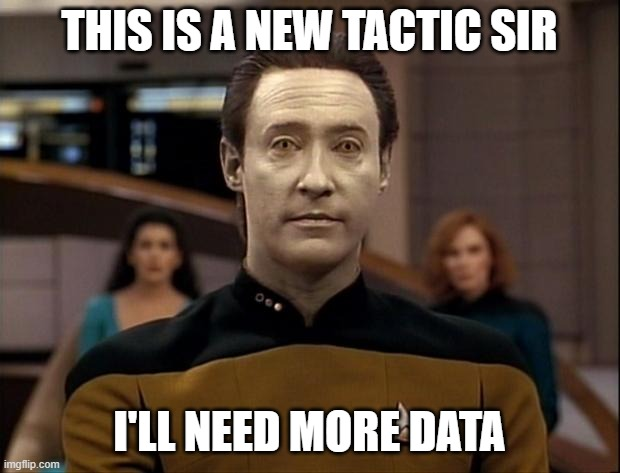
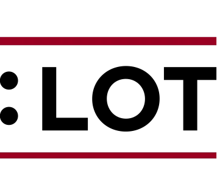

# Case study: movie dialogs

## Cornell Movie Dialogs Corpus

The data comes from the [Cornell Movie Dialogs Corpus](https://www.cs.cornell.edu/~cristian/Cornell_Movie-Dialogs_Corpus.html){target="_blank"}, which is part of the [Cornell Conversational Analysis Toolkit](https://convokit.cornell.edu/){target="_blank"} by Cristian Danescu-Niculescu-Mizil and Lillian Lee.

Download the files from our OSF repository if you hadn't.

<https://osf.io/598fk/>

## Metadata

The README.txt file *used to* say that we should be looking at

-   `movie_lines.txt`  (34 MB)
-   `movie_titles_metadata.txt` (67 KB)

The first two lines of the `movie_titles_metadata.txt` file look like this <br> 😵‍💫😵‍💫

```         
m0 +++$+++ 10 things i hate about you +++$+++ 1999 +++$+++ 6.90 +++$+++ 62847 +++$+++ ['comedy', 'romance']
m1 +++$+++ 1492: conquest of paradise +++$+++ 1992 +++$+++ 6.20 +++$+++ 10421 +++$+++ ['adventure', 'biography', 'drama', 'history']
```

So how should we read this in?

## First set up our new document

1.  Make a new Rmd file and save it
2.  Delete the unnecessary lines
3.  Write the following set-up chunk

```{r}
#| echo: true
#| eval: true
library(tidyverse)
library(here)
```

## Read in files

We are going to use `readr::read_lines()`

```{r}
#| echo: true
#| eval: true

meta <- read_lines(here("casestudy_movie_corpus", "movie_titles_metadata.txt"))

# inspect the first 6 entries
head(meta)
```

## Wrangle into tidy dataframe

So our knowledge of strings will come in handy (because of that `+++$+++`). We are also using a new function to later *separate* each line into different columns.

```{r}
#| echo: true
#| eval: true
#| code-line-numbers: "1|2|3|4-7"
metadata <- meta %>%
  str_replace_all(" \\+\\+\\+\\$\\+\\+\\+ ", "@@") %>%
  as_tibble() %>% # turn into tibble
  separate(value, 
           into = c("code", "title", "year", 
                    "imdb.rating", "imdb.votes", "genre"), 
           sep = "@@") # split into columns
```

## Wrangle into tidy dataframe

```{r}
#| eval: true
metadata
```

## Best practice: don't be afraid of new lines 😎💯💅

```{r}
#| echo: true
#| eval: true
#| code-line-numbers: "4-7"
metadata <- meta %>%
  str_replace_all(" \\+\\+\\+\\$\\+\\+\\+ ", "@@") %>%
  as_tibble() %>% # turn into tibble
  separate(value, 
           into = c("code", "title", "year", 
                    "imdb.rating", "imdb.votes", "genre"), 
           sep = "@@") # split into columns
```

::: callout-tip
Rstudio aligns when you press ENTER, it makes code more legible for human eyes.
:::

## Star Trek movies



## Star Trek movies

Let's look for Star Trek movies

```{r}
#| eval: true

startreksubset <- metadata %>%
  filter(str_detect(title, "star trek")) 

startreksubset
```

## Star Trek movies

And at this point it is also useful to get the codes themselves (you'll see why below).

```{r}
#| echo: true
#| eval: true
#| code-line-numbers: "|2"

startreknumbers <- startreksubset %>%
  pull(code) # we can pull a column as a vector out of a dataframe

startreknumbers
```

## Time to read in the movielines

```{r}
#| echo: true
#| eval: true
#| code-line-numbers: "|1|2|4"

movielines1 <- # sometimes you can add a suffix like "1" when you're exploring
  read_lines(here("casestudy_movie_corpus", "movie_lines.txt"))

head(movielines1) # sometimes it's useful to only look at the first 6 elements
```

Oh oh this is the same! 😵‍💫😵‍💫

## Time to read in the movielines

But we can just copy the code, and change the names of the columns!

```{r}
#| echo: true
#| eval: true
#| code-line-numbers: "|1-2|3-7|6"
movielines <- 
  movielines1 %>%
  str_replace_all(" \\+\\+\\+\\$\\+\\+\\+ ", "@@") %>%
  as_tibble() %>%
  separate(value, 
           into = c("line.id", "character.id", "code", "character", "line"), 
           sep = "@@")

head(movielines)
```

## Getting a nice tibble

One of the strongest functions of `dplyr` we haven't seen is the family of `joins.` <br> Today we'll see my favorite join: `dplyr::left_join()`.

But which tables should we join together? <br> Let's run these two.

```{r}
#| echo: true
#| eval: false
startreksubset %>% head()
movielines %>% head()
```

## Getting a nice tibble

If we start from the [smaller]{.alert2} dataset (`startreksubset`) and then `left_join()` the bigger one (`movielines`) by the **common variable** we get a nice tidy dataset.

```{r}
#| echo: true
#| eval: false
#| code-line-numbers: "|2|3"

df <- 
  startreksubset %>% # smaller subset
  left_join(movielines, by = join_by(code)) # bigger subset

df
```

## Exporting our hard work

After all this data wrangling, we can export our nice tidy dataframe to e.g. a `.csv` file!

Let's put it in the data folder of our project

```{r}
#| echo: true
#| eval: false

write_csv(df, 
          here("data", "startrekmovies.csv"),
          col_names = TRUE)
```

## Let's inspect it briefly

It's often good to have a quick look if your output is what you want.

## Read in our tidy dataframe

```{r}
#| echo: true
#| eval: true

df <- read_csv(here("data", "startrekmovies.csv"),
               col_names = TRUE)

df
```

. . .

Okay, that seemed to work!

## Species mentioned

This is our cliffhanger for today: the `tidytext` package with its main function of `unnest_tokens()`

Let's look at its basic usage (after loading it of course).

```{r}
#| echo: true
#| eval: true

library(tidytext)
# install.packages("tidytext")  # put this in the console, you don't need to rerun it every time
```

## A word about Star Trek species


Bajoran, Ferengi, [Vulcan]{.alert2}, Andorian, <br>
Cardassian, Orion, [Klingon]{.alert2}, [Borg]{.alert2}


## Species mentioned

```{r}
#| echo: true
#| eval: true
#| code-line-numbers: "|1|2|3|4-6|7"

species <- 
  df %>%
  select(title, character, line, year) %>%
  tidytext::unnest_tokens(output = words, # name of output column
                          input = line,   # name of input columm
                          token = "words") %>% # split by what kind
  filter(str_detect(words, "human|vulcan|klingon|romulan|borg")) # filtering with regex!
```

. . .

```{r}
#| eval: true
# let's count
count(species, words, sort = TRUE)
```

## Species mentioned

Because we want to be a bit more precies and count all of the relevant species together, we may want to turn e.g. `humans` into `human`, with `case_when()`.

```{r}
#| echo: true
#| eval: true
#| code-line-numbers: "|2|3-9|1"

species2 <- 
  species %>%
  mutate(species = case_when(
    str_detect(words, "human") ~ "human",
    str_detect(words, "vulcan") ~ "vulcan",
    str_detect(words, "klingon") ~ "klingon",
    str_detect(words, "romulan") ~ "romulan",
    str_detect(words, "borg") ~ "borg",
    TRUE ~ words
  ))
```

```{r}
#| eval: false
species2 %>%
  count(species, sort = TRUE)
```

## Visualize

Let's visualize

```{r}
#| echo: true
#| eval: true
#| output-location: slide 
#| code-line-numbers: "|2-3|4|5|6|7|1"

species_plot <- 
  species2 %>%
  count(year, species) %>%
  ggplot(aes(x = year, y = n, color = species)) +
  geom_point() +
  geom_line(aes(group = species)) +
  theme_minimal()

species_plot
```

## Save the plot

```{r}
ggsave(plot = species_plot,
       filename = here("figures",
                       "species.png"))
```

## Inspect the lines per species

```{r}
#| code-line-numbers: "|7"
#| eval: true
#| output-location: slide
species2 %>%
  count(year, species) %>%
  ggplot(aes(x = year, y = n, color = species)) +
  geom_point() +
  geom_line(aes(group = species)) +
  theme_minimal() +
  facet_wrap(vars(species))
```

------------------------------------------------------------------------

{fig-align="center"}


