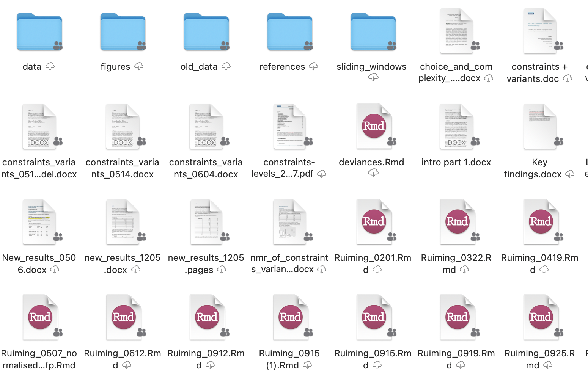
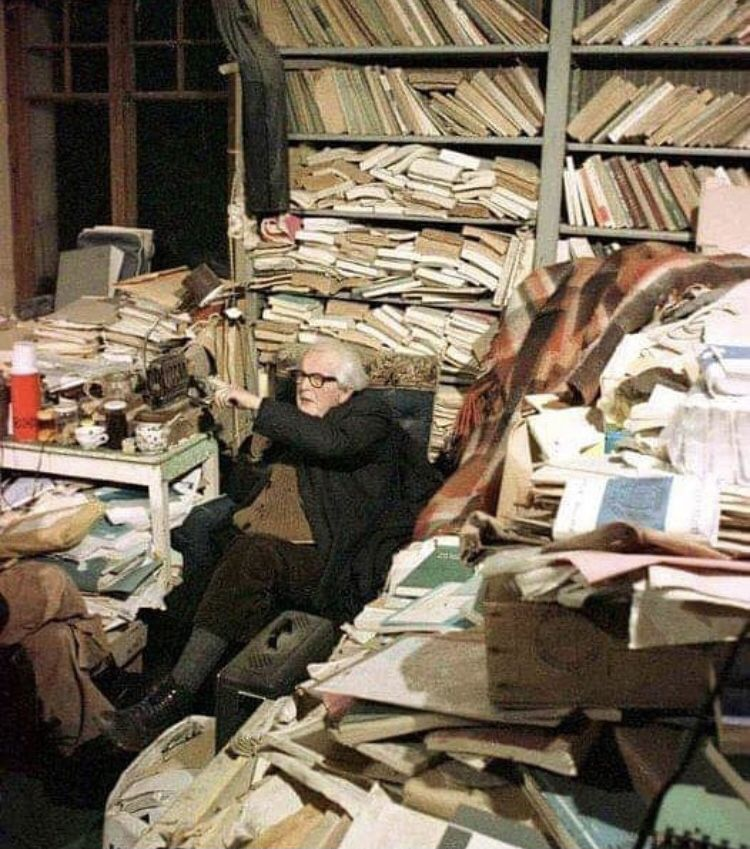
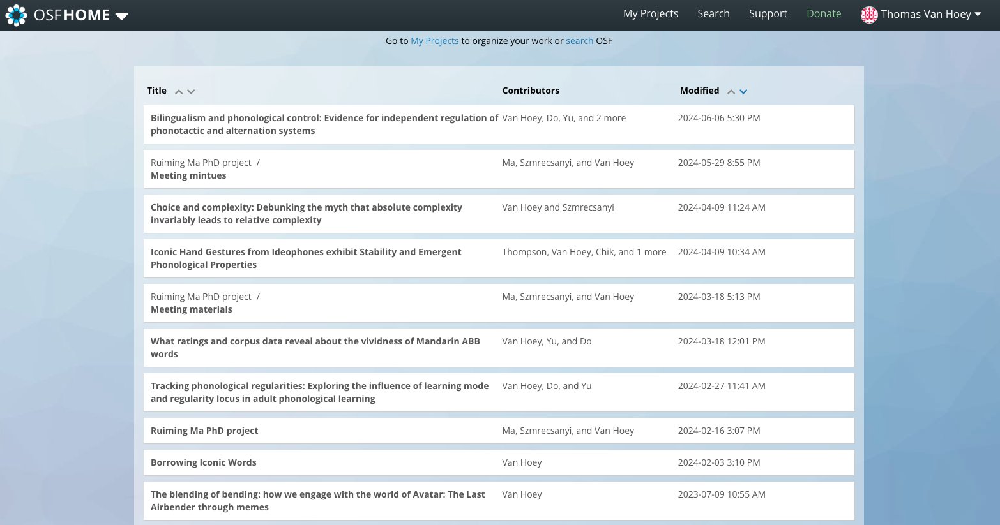
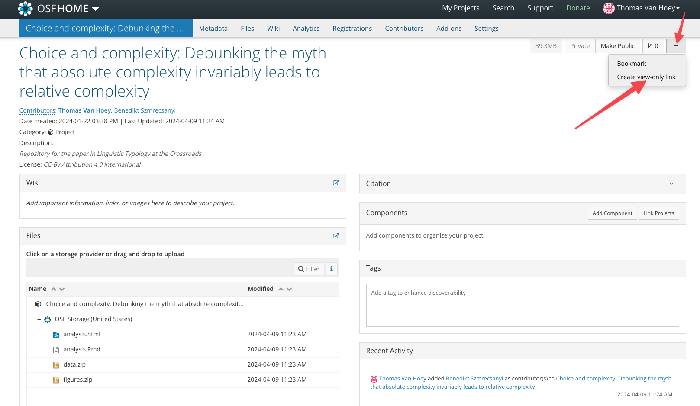
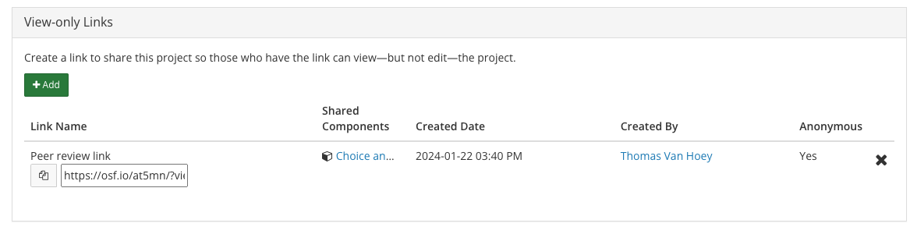

# Some introductions

## Thomas Van Hoey

::: columns
::: {.column width="30%"}
{fig-align="left"}
:::

::: {.column width="70%" .font70}
-   Postdoctoral researcher at the KU Leuven at the Quantitative Lexicology and Variational Linguistics research unit.
-   Current projects: 
    - Studying the borrowability of ideophones (iconic words) across languages
    - The relationship between dysfluencies and grammatical optionality
-   Previously at National Taiwan University and the University of Hong Kong
-   Training: sinologist and a linguist
-   R is my go-to language to solve daily problems
    - this presentation was made with R, for example
    
:::
:::


## Who are you and what is your experience with programming languages?


## What this crashcourse is

Outcomes:

(1) Introductory approach to the data science pipeline
(2) Regular expressions
(3) Working with text corpora
(4) Applications based on your questions

--

I don't know how far we can get but I'll also point to some resources.


## Introductory approach to the data science pipeline

-   setting up projects
-   keeping track of changes and advances
-   reporting
-   storing data for the future

In other words: [cultivating the inner data scientist]{.alert}


## Sidenote: Re\*bility


## Side note: Programmer vs. data scientist


[source](https://www.kdnuggets.com/2023/06/programming-languages-specific-data-roles.html){.font70}

<!-- ## Side note: Programmer vs. data scientist -->

<!--  -->

<!-- [source](https://miro.medium.com/max/1400/1*WvOnZ27TdPUbJfa9q21QJw.png){.font70} -->

<!-- ## Side note: Programmer vs. data scientist -->

<!--  -->


<!-- [source](https://towardsdatascience.com/how-data-science-silos-undermine-application-modernization-14cee5ff3047){.font70} -->

##Literate programming

::: columns
::: {.column width="50%"}
-   R for reading in data
-   R for wrangling data
-   R for modeling
-   R for taking notes
-   R for presenting
-   R for writing
:::

::: {.column width="50%"}

:::

In other words: [R for everything mindset]{.alert} (at least for today)
:::

##  Why R? A steep learning curve

::: r-stack
{.fragment .fade-out}

{.fragment}
:::

## Why R then?

::: {.font70}
1.  Data manipulation.
2.  Automation.
3.  Faster computation.
4.  Any type of data (.txt, .csv, .dat, etc.).
5.  Easier project organization.\
6.  Larger data sets (though not always big data).
7.  Reproducibility.\
8.  Accuracy.
9.  Easier to find and fix errors.
10. Free.
11. Open source.
12. Advanced statistics.
13. State-of-the-art graphics.
14. Many platforms
15. Packages!

[Source for inspiration](https://fantasyfootballanalytics.net/2014/01/why-r-is-better-than-excel.html)
:::

## Side note: Use the right tool for the right job

-   Don't throw out Excel! [(see this podcast )](https://www.datacamp.com/community/podcast/spreadsheets-data-science)
-   But you can use opensource spreadsheet software like LibreOffice
-   or Google Slides
-   or Numbers
-   or NotePad++
-   ...

## Side note: ChatGPT

It must be said: you *can* ask ChatGPT to help you code.

But, to evaluate what generated code does, you still need a basic understanding (regardless of the programming language).

--

For instance, I know more or less how python works but I don't write it often enough to be fluent in it. But I am able to evaluate (basic) scripts that I get from ChatGPT or other LLMs.


# Let's get started

## Installing R

Prior to this class, I asked you to install R.

Who has done that? 🙋🙋

## R 4.6.1 (2026-06-14)

### 'Happy Hop'(or newer)

You can download it by clicking this link: https://cran.r-project.org/mirrors.html

Download the version that is the right one for your operating system (Windows / Mac)

Problems? https://www.r-project.org


# Installing RStudio

## RStudio

[RStudio](https://posit.co/){.external target="_blank"} is a Graphical User Interface for R and the one that is used by most people.

You can already use R by just opening it, but RStudio makes it easier.

Originally, RStudio was developed by the company Rstudio but they rebranded to [Posit]{.alert} a few years ago.

## Downloading

Go to [https://posit.co/download/rstudio-desktop/](https://posit.co/download/rstudio-desktop/){.external target="_blank"}

And also select the version for your operating system.

## RStudio

::: columns
::: {.column width="50%"}


:::

::: {.column .font70 width="50%"}
(1) Top-left panel: **Code editor** allowing you to create and open a file containing R scripts and Rmarkdown documents.
(2) Bottom-left panel: **R console** for typing R commands
(3) Top-right panel:

-   **Workspace tab**: shows the list of R objects you created during your R session
-   **History tab**: shows the history of all previous commands

(4) Bottom-right panel:

-   **Files tab**: show files in your working directory
-   **Plots tab**: show the history of plots you created. From this tab, you can export a plot to a PDF or an image files
-   **Packages tab**: show external R packages available on your system. If checked, the package is loaded in R.
:::
:::

## RStudio Settings

### Open settings

::: columns
::: column
Windows

-   Tools → Global Options
-   shortcut: `CTRL ,`
:::

::: column
Mac

-   Tools → Global Options
-   Shortcut `⌘ ,`
:::
:::

✓ - Uncheck "Restore .RData into work space at start up"

✓ - Set "Save work space to .Rdata on exit" to "Never"

[[Source of tip: Emil Hvitfeldt](https://emilhvitfeldt.com/talk/2021-11-23-barcelona/)]{.font70}

## Rstudio settings

We can change what our RStudio looks like

[Appearance]{.alert2}: change the [color]{.alert} to what you want (I like `Cobalt`)


## Rstudio settings

[*Pane lay-out*]{.alert2}

I suggest

-   top-left [**code editor**]{.alert}
-   top-right [**R console**]{.alert}
-   bottom-left [**environment, history**]{.alert}
-   bottom-right [**files, plots, packages...**]{.alert}

But you're free to experiment of course

## R the calculator

The [console]{.alert} can be used as a simple calculator

Type / copy the following commands in the console

```{r}
#| eval: false
#| echo: true
1 + 1
3 - 2
4 * 5
10 / 2
```

The output will look like this

```
[1] 2
[1] 1
[1] 20
[1] 5
```

## R script

Now we're going to make an R script.

Click: [`file > new file > R Script`]{.alert}

Copy the previous calculations

```{r}
#| echo: true
#| eval: false
1 + 1
3 - 2
4 * 5
10 / 2
```

Click "Run"

## R script

You can:

-   (save it somewhere, doesn't matter now)
-   run the whole script
-   run line by line
    -   Windows: `CTRL  ENTER`
    -   Mac: `⌘  ENTER`

Below you can just keep copying the examples to this script.

## \<- operator

You can also [assign]{.alert} a value to a [variable]{.alert} and then call that variable

You assign with the `<-` operator

Think of it like the [container]{.smallcaps} metaphor: you put something in something else

```{r}
#| eval: false
#| echo: true

var1 <- 2 # type arrow hyphen <-

var1
```

📝

`=` can also be used as an operator, but it is better to [use if for arguments within a function]{.alert}, rather than for variables

## c() operator

But you can also put more than one value in a variable, with the `c()` function

(`c` stands for 'concatenate')

```{r}
#| echo: true
#| eval: false

var2 <- c(0.1, 0.2)

var2
```

## Other types of data

Of course you can also put words into variables, so-called [character strings]{.alert2})

```{r}
#| echo: true
var3 <- c("hello", "world", "你好")
```

Or you can put in [logical values]{.alert2}

```{r}
#| echo: true
var4 <- c(TRUE, FALSE)
```

. . .

After you run these two commands, you can check your [Environment tab]{.alert} and see that, indeed, all these variables exists in your current R session.

By looking at the [History tab]{.alert} you can see all the things R has done.

## Functions

Both `<-` and `c()` are functions: they act like the verbs in formal syntax

$$KISS(X, Y)$$

So, *John kisses Mary* can be expressed like

$$KISS(X = John, Y = Mary)$$

with

-   `KISS()` is the "verb"
-   `X` and `Y` are the arguments
-   `Zhangsan` and `Lisi` are the values of the arguments
-   📝 we use `=` for arguments in the function!

## Functions

Let's say we want to know what the mean is of the numbers 1 to 10.

We will need `c()`, then the numbers (by typing `1, 2, 3, ..., 10` or with the shortcut `1:10` '1 to 10').

Then we need to calculate the mean, either the long way ($\Sigma_{i}^{n} / n$) or the short way with `mean()`.

. . .

```{r}
#| echo: true
var5 <- c(1:10)
mean(var5)

# or
mean(c(1:10))
# or
mean(1:10)
```

## Dataframes

Data becomes most interesting if we can relate different things together.

That is where the [dataframe]{.alert} comes in.

A dataframe is basically a kind of [spreadsheet]{.alert2}, composed of different [vectors]{.alert} of **equal length**.

And we are going to make one!

```{r}
#| echo: true
#| eval: false
name <- c("Wilhelmina", "Juliana", "Beatrix", "Willem-Alexander")
gender <- c("female", "female", "female", "male")
job <- c("queen", "queen", "queen", "king")

data.frame(name, gender, job)
```


## Dataframes

```{r}
#| echo: true
name <- c("Wilhelmina", "Juliana", "Beatrix", "Willem-Alexander")
gender <- c("female", "female", "female", "male")
job <- c("queen", "queen", "queen", "king")

data.frame(name, gender, job)
```

You can also assign this of course:

```{r}
#| echo: true
myfirstdataframe <- data.frame(name, gender, job)

myfirstdataframe
```

## Dataframes and tibbles

I find that most things in R work best, or are most intuitive, if they are in a dataframe ([rectangle format]{.alert}).

So far, we have been using [Base R]{.alert2} (the basic functions that R always provides).

But in reality, I rarely use `data.frame()` -- instead I use the `tibble()` function from the `tidyr` package, which is part of the [tidyverse]{.alert}

```{r}
#| echo: true
#| eval: false
#| code-line-numbers: "|1"
tidyr::tibble()
# vs
data.frame()
```

## Installing packages

It is very easy to install packages in R.

Most packages will be available on CRAN, the network where accepted (and valid) packages are distributed.

If you want to install, e.g. the `tidyverse` package, you should do it like this:

```{r}
#| echo: true
#| eval: false
install.packages("tidyverse")
```

Do that now.

If it asks you if it should install other packages, you can say yes.

## Installing packages

Here are a number of other packages that are good to have (we will use them one of these weeks):

```{r}
#| eval: false
#| echo: true
#install.packages("rvest") # included in tidyverse
# install.packages("glue") # included in tidyverse
install.packages("rmarkdown")
install.packages("knitr")
install.packages("tidytext")
# install.packages("quanteda") # maybe we'll use it
install.packages("here")
install.packages("fs")
install.packages("readxl")
install.packages("writexl")
```


## Basic tidy R process

 [[source](https://tidyverse.tidyverse.org/articles/paper.html)]{.font70}

With this basic process, we can tackle a lot of problems.

## Rstudio Projects  [(Explore on your own)]{.alert}


Instead of an Rscript, it is better to use [RStudio Projects]{.alert2}

So click [`File > New Project > New Directory`]{.alert} and find a folder for it on your system.




## Rstudio Projects [(Explore on your own)]{.alert}

The advantages of using R Projects:

-   self contained folder
-   keep all relevant code together
-   you can send the folder to somebody
-   functions in the `here` package

. . .

instead of the long path "USERS/THOMAS/.../.../.../.../.../...(forever)"

you start from where that [.Rproject]{.alert2} object is located

→ files are easier to find


# Instead, Quarto document as the anchor itself

## Let's make a `.qmd`

Let's create a new file:

`File > New file > Quarto Document`


## Quarto documents

When you open a new file, you can test the export by clicking the `Render` button.

(and `Knit` in Rmarkdown files)


## Quarto documents

Now delete everthing starting from [line 6]{.alert2}.

We are left with the [YAML]{.alert2} header

-   title
-   format


## R chunks

Instead of one big R script, an [Rmarkdown]{.alert2} document works with [R chunks]{.alert2}

````
```{ r} #(without the space before the r)
SOME R CODE
```
````

This way you can incrementally make your code longer, <br> [have a conversation with your data.]{.alert}

Shortcuts:

-   Windows: `CTRL + ALT + i`
-   Mac: `⌘  + OPTION + i`

## Loading packages

```{r}
#| eval: false
#| echo: true
# the tidyverse, we will always load this
library(tidyverse)

# `here` for easy file paths
library(here)
here()

# readxl for reading excel files
library(readxl)
```

```{r}
#| echo: false
# the tidyverse, we will always load this
library(tidyverse)

# `here` for easy file paths
library(here)

# readxl for reading excel files
library(readxl)
```

## Worst practice 👿🤡

Traditionally, this is how people start a script:

```{r}
#| echo: true
#| eval: false
setwd("C:\Users\jenny\path\that\only\I\have")
#or
rm(list = ls())
```

But know that

-   Mac uses `/` and Windows uses `\`
-   Nobody else will have this path (including future you)

→ Violation of reproducibility

## Worst practice 👿🤡

::: columns
::: column

:::

::: column

:::
:::

[[source: Jenny Bryan](https://www.tidyverse.org/blog/2017/12/workflow-vs-script/)]{.font70}

## Best practice 😎💯💅

Use the [here]{.alert2} package

-   Finds the nearest .Rproj file
-   alternatively, you can specify `here::i_am("NAME_OF_QMD.qmd)`
    - or `here::i_am("NAME_OF_RMD.Rmd)`

# A workflow case study


## Let's read in some data

Download the file "linguistsdataset.xlsx" from the OSF repository
([https://osf.io/598fk/](https://osf.io/598fk/)).

Place it into your [LOT2024 folder]{.alert2} in a folder called `data`.

## Let's read in some data

```{r}
#| eval: false
#| echo: true
dataset <- read_excel(here("data", "linguistsdataset.xlsx"))
```

```{r}
#| echo: false
dataset <- read_excel(here("data", "linguistsdataset.xlsx"))
```

What did we do?

-   put our function in a variable with `<-`
-   read an excel file with `read_excel()`
-   the location of the file should be inside the \[LOT2024/data\] folder, so we can use `here("data", "linguistsdataset.xlsx")`

## Check the file

Let's call the dataset and see what the [tibble]{.alert2} looks like

```{r}
#| echo: true
dataset
```

<!-- ## Check the file -->

<!--  -->

<!-- -   see the names of the variables (columns) -->
<!-- -   all the rows -->
<!-- -   what kind of data it is (numeric, logical, character...) -->

<!-- # After reading comes wrangling -->

<!-- ## dplyr "verbs" -->

<!-- With the `dplyr` package (loaded through the `library(tidyverse)`) we can manipulate the data. -->

<!-- This is where I tell you about the [CHEAT SHEETS](https://posit.co/resources/cheatsheets/). -->

<!-- You can also access them through Rstudio: `Help > Cheat Sheets > Data Transformation with dplyr` -->

<!-- ## dplyr "verbs" -->

<!-- As you can see there are MANY verbs in the `dplyr` package. -->

<!-- But fear not: the most important ones are -->

<!-- -   `select` and `filter` and `distinct` and `slice` -->
<!-- -   `summarise` and `count` and `tally` -->
<!-- -   `group_by` and `ungroup` -->
<!-- -   `mutate` and `rename` and `case_when` -->
<!-- -   `arrange` -->

<!-- Basically the first page. I use these like 80% of the time. -->

<!-- ## dplyr "verbs" -->

<!-- Let's say we want to see how many rows (observations) per linguist we have in this mini dataset. -->

<!-- ::: columns -->
<!-- ::: column -->
<!-- ```{r} -->
<!-- #| echo: true -->
<!-- dataset %>% -->
<!--   count(linguist_lastname) -->
<!-- ``` -->

<!-- So it seems we have 6 people (number of rows) -->
<!-- ::: -->

<!-- ::: {.column .fragment} -->
<!-- ```{r} -->
<!-- #| echo: true -->

<!-- # alternative 1 -->
<!-- dataset %>% -->
<!--   count(linguist_lastname) %>% -->
<!--   nrow() -->

<!-- # alternative 2 -->
<!-- nrow(count(dataset, linguist_lastname)) -->
<!-- ``` -->
<!-- ::: -->
<!-- ::: -->

<!-- ## The pipe -->

<!--  -->

<!-- . . . -->

<!-- `|>` is the Base R pipe -->

<!-- `%>%` is the tidyverse pipe (shortcut: `CTRL/⌘ + Shift + M`) -->

<!-- [mostly the same](https://www.tidyverse.org/blog/2023/04/base-vs-magrittr-pipe/) but the tidyverse pipe came first <br> (in the `magrittr` package) -->

<!-- ## Male vs. female -->

<!-- How about male versus female? -->

<!-- ```{r} -->
<!-- #| eval: false -->
<!-- #| echo: true -->
<!-- dataset %>% -->
<!--   distinct(linguist_lastname, gender) %>% -->
<!--   count(gender) -->
<!-- ``` -->

<!-- . . . -->

<!-- ```{r} -->
<!-- #| eval: true -->
<!-- #| echo: false -->
<!-- dataset %>% -->
<!--   distinct(linguist_lastname, gender) %>% -->
<!--   count(gender) -->
<!-- ``` -->

<!-- ## Lifespan -->

<!-- Now we want to know how old every linguist is, or how long they lived -->

<!-- So we will need the columns `date_born` and `date_died`. -->

<!-- But if we look at `date_died` there are two problems: -->

<!-- -   this is a character vector -->
<!-- -   there are a lot of linguists still alive -->

<!-- So we need to \[mutate\] `date_died` to the current year (2024). -->

<!-- ## Lifespan -->

<!-- We'll do this in a few steps: -->

<!-- Select the variables `linguist_lastname`, `date_born`, `date_died` -->

<!-- ```{r} -->
<!-- #| echo: true -->
<!-- #| eval: false -->
<!-- dataset %>% -->
<!--   select(linguist_lastname, date_born, date_died) -->
<!-- ``` -->

<!-- ## Lifespan -->

<!-- we need to change `"alive"` to `"2024"` -->

<!-- ```{r} -->
<!-- #| echo: true -->
<!-- #| eval: false -->
<!-- #| code-line-numbers: "3-6" -->
<!-- dataset %>% -->
<!--   select(linguist_lastname, date_born, date_died) %>% -->
<!--   mutate(date_died = case_when( -->
<!--     date_died == "alive" ~ "2024", -->
<!--     TRUE ~ date_died -->
<!--   )) -->
<!-- ``` -->

<!-- . . . -->

<!-- ```{r} -->
<!-- #| echo: false -->
<!-- #| eval: true -->
<!-- dataset %>% -->
<!--   select(linguist_lastname, date_born, date_died) %>% -->
<!--   mutate(date_died = case_when( -->
<!--     date_died == "alive" ~ "2024", -->
<!--     TRUE ~ date_died -->
<!--   )) -->
<!-- ``` -->

<!-- ‼️ [Do you notice something off here?]{.alert} -->

<!-- ## Lifespan -->

<!-- We need to turn `date_died` in a numeric vector (not character) -->

<!-- ```{r} -->
<!-- #| echo: true -->
<!-- #| eval: false -->
<!-- #| code-line-numbers: "7" -->
<!-- dataset %>% -->
<!--   select(linguist_lastname, date_born, date_died) %>% -->
<!--   mutate(date_died = case_when( -->
<!--     date_died == "alive" ~ "2024", -->
<!--     TRUE ~ date_died -->
<!--   )) %>% -->
<!--   mutate(date_died = as.numeric(date_died)) -->
<!-- ``` -->

<!-- ## Lifespan -->

<!-- calculate `lifespan` and put in `lifespandf` object -->

<!-- ```{r} -->
<!-- #| echo: true -->
<!-- #| code-line-numbers: "1,8-11" -->
<!-- lifespandf <- -->
<!--   dataset %>% -->
<!--   select(linguist_lastname, date_born, date_died) %>% -->
<!--   mutate(date_died = case_when( -->
<!--     date_died == "alive" ~ "2024", -->
<!--     TRUE ~ date_died -->
<!--   )) %>% -->
<!--   mutate(date_died = as.numeric(date_died)) %>% -->
<!--   mutate(lifespan = date_died - date_born) -->

<!-- lifespandf -->
<!-- ``` -->

<!-- ## First visualization with ggplot2 -->

<!-- How old did every linguist get? -->

<!-- ```{r} -->
<!-- #| echo: true -->
<!-- #| eval: false -->
<!-- lifespandf %>% -->
<!--   ggplot(aes(x = linguist_lastname, y = lifespan)) + -->
<!--   geom_point() -->
<!-- ``` -->

<!-- ‼️ Note that `ggplot` uses `+` instead of a regular pipe (`|>` or `%>%`). -->

<!-- . . . -->

<!-- ```{r} -->
<!-- #| echo: false -->
<!-- #| out-width: 70% -->
<!-- lifespandf %>% -->
<!--   ggplot(aes(x = linguist_lastname, y = lifespan)) + -->
<!--   geom_point() -->
<!-- ``` -->

<!-- ## Clean up visualization -->

<!-- ```{r} -->
<!-- #| echo: true -->
<!-- #| code-line-numbers: "2|5|6|7|8" -->
<!-- lifespandf %>% -->
<!--   rename(linguist = linguist_lastname) %>% #rename -->
<!--   ggplot(aes(x = linguist, y = lifespan)) + -->
<!--   geom_point() + -->
<!--   geom_label(aes(label = lifespan)) + # add label of lifespan -->
<!--   theme_minimal() + # add theme -->
<!--   theme(axis.text = element_text(size = 14)) + # change size -->
<!--   labs(title = "The lifespan of some linguists") # add title -->
<!-- ``` -->

<!-- ## Basic tidy R process -->

<!--  -->

<!-- ## Basic tidy R process -->

<!-- So we have -->

<!-- 1.  imported the linguists mini dataset -->
<!-- 2.  tidied it (by using `readxl`) -->
<!-- 3.  transformed it to our needs -->
<!-- 4.  visualized it -->
<!-- 5.  [still to do:]{.alert}[communicate:]{.alert2} -->

<!-- . . . -->

<!-- ``` -->
<!-- Chomsky is the oldest with 96 years old and counting. -->
<!-- Goldberg is now older than de Saussure was when he died. -->
<!-- Langacker is one year younger than Lakoff and they are approaching Wierzbicka who is 86 years old. -->
<!-- ``` -->

<!-- . . . -->

<!-- Suppose this is your groundbreaking research, let's increase its reproducibility -->

<!-- ## Worst practice 👿🤡 -->

<!-- ::: columns -->
<!-- ::: column -->
<!--  -->
<!-- ::: -->

<!-- ::: column -->
<!--  -->
<!-- ::: -->
<!-- ::: -->

<!-- ## Best practice 😎💯💅 -->

<!-- [Keep a consistent folder structure!]{.alert2} -->

<!-- I've written about [this here](https://www.thomasvanhoey.com/post/2021-05-12-setting-up-a-clean-project-the-best-practice-i-use/). <br> [(This also includes a bit of GitHub, which I can explain if necessary).]{.font70} -->

<!-- -   README.md → describes folder structure -->
<!-- -   Rproj → root so we can transport the project -->
<!-- -   data/ folder → data we import -->
<!-- -   scripts/ folder → records of our analyses -->
<!-- -   figures/ folder → what we generate -->
<!-- -   output/ folder → what we generate -->
<!-- -   to_osf/ folder → what will be shared? -->

<!-- ## Best practice 😎💯💅 -->

<!-- You may want to do this programmaticallly, at the start of your project, right after you made the R project: -->

<!-- ```{r} -->
<!-- #| eval: false -->
<!-- #| echo: true -->
<!-- library(fs) -->
<!-- library(here) -->

<!-- dir_create(here(c("data", -->
<!--                   "scripts", -->
<!--                   "figures", -->
<!--                   "output", -->
<!--                   "to_osf"))) -->
<!-- ``` -->

<!-- ## Worst practice 👿🤡 -->

<!-- Things we see way too often in papers: -->

<!-- ::: callout-note -->
<!-- > "Please consult author X for data" -->

<!-- > "The data come from the following source: Google/Twitter/X/..." -->

<!-- > "Trust me I have it somewhere" -->
<!-- ::: -->

<!-- ## Best practice 😎💯💅 -->

<!-- ::: callout-tip -->
<!-- Use a repository -->
<!-- ::: -->

<!-- -   [OSF.io](https://osf.io/) - Open Science Framework -->
<!--     -   [has anomymous peer review link]{.alert} -->
<!--     -   can set [private]{.alert} or [public]{.alert} -->
<!--     -   links well with [ORCid](https://orcid.org/) -->
<!-- -   [TROLLING](https://dataverse.no/dataverse/trolling) - Tromsø Linguistics repository -->
<!-- -   [RDR](https://www.kuleuven.be/rdm/en/rdr) - Research Data Repository at KU Leuven -->
<!-- -   [Zenodo](https://zenodo.org/) -->
<!-- -   [GitHub](https://github.com/) -->
<!-- -   your own institution? -->

<!-- ## Best practice 😎💯💅 -->

<!--  -->

<!-- ## Best practice 😎💯💅 -->

<!--  -->

<!-- ## Best practice 😎💯💅 -->

<!--  -->

<!-- This will also make your reviewers happy, because you share the code, but it anonymous. -->

<!-- ## The end of today -->

<!-- {fig-align="center"} -->
